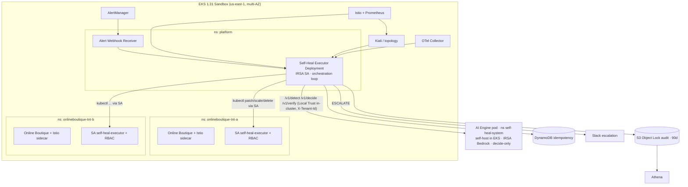

# Infrastructure Design - Task Force 3 · CDO-02

<!-- Doc owner: Nhóm CDO-02
     Status: Draft (W11 T3-T4) → Final (W11 T6 Pack #1) → Updated (W12 T4 Pack #2)
     Word target: 1500-2500 từ
     Differentiation angle: K8s-heavy / in-cluster Kubernetes Workflow Orchestration -->

> **Phạm vi**: platform CDO-02 host + tích hợp AI Self-Heal Engine theo 3 contracts (xem [`../contract-review-notes.md`](../contract-review-notes.md)). Chạy **Live mode** (telemetry + execution thật trên sandbox EKS), CSV RE2/RE3 làm fallback.
> **Boundary (chốt với AIO)**: AI **chỉ decide** (trả `action_plan`), **không giữ kubeconfig / không gọi EKS**. CDO executor (in-cluster) mới thực thi qua ServiceAccount RBAC.

## 1. Architecture diagram



*Caption: Executor chạy **trong cluster** (ns `platform`), nhận alert từ AlertManager, gọi AI engine để decide, rồi tự thực thi action lên workload tenant qua **in-cluster ServiceAccount RBAC** (không cần kubeconfig ngoài). Mọi bước qua 5 safety guardrail; audit ghi S3 Object Lock; idempotency khoá DynamoDB.*

## 2. Component table

| Component | AWS / tool | Reason | Cost note |
|---|---|---|---|
| Container orchestration | **EKS 1.31** (multi-AZ) | Khớp Client n-1; host workload + executor + target self-heal | control plane $0.10/h + node spot |
| Sample workload | **Online Boutique + Istio** | Khớp dataset RE2/RE3; Istio cấp metric + tracing + topology 1 stack | trong node cost |
| **Self-Heal Executor** | **Deployment trong ns `platform`** (Python orchestrator, IRSA) | Chạy sát workload, thực thi qua in-cluster SA (no external kubeconfig) | 1 pod nhỏ always-on |
| Alert ingestion | AlertManager → **in-cluster webhook receiver** | Trigger executor; webhook đủ cho capstone | trong cluster |
| Telemetry source | **Istio + Prometheus** | `service_error_rate`, `service_latency_p95`, resource | rẻ |
| Tracing + Topology | **OTel Collector + Kiali** | Đáp ứng yêu cầu mới AI (P7): trace + service graph | rẻ |
| Execution identity | **per-tenant ServiceAccount + RBAC** | least-privilege, scope namespace tenant | — |
| Idempotency lock | **DynamoDB** conditional write (IRSA) | trùng `Idempotency-Key` → 409 | on-demand |
| Audit trail | **S3 Object Lock (Compliance 90d)** (IRSA) | tamper-evident WORM cho SOC2 | rẻ |
| Audit query | **Athena** | SQL audit cho AI/mentor | pay-per-scan |
| GitOps | **ArgoCD** | sync executor + workload + Istio từ Git | trong cluster |
| Escalation | **Slack webhook** | brief: Slack đủ | free |
| Observability | Prometheus + Grafana + CloudWatch | metrics/logs/dashboard SLO | rẻ |

## 3. Differentiation angle deep-dive

### 3.1 Angle chọn: K8s-heavy / in-cluster workflow orchestration

Executor là **Deployment chạy trong cluster** (ns `platform`), điều phối nguyên vòng self-heal và thực thi action lên workload tenant qua **in-cluster ServiceAccount**. 5 safety checkpoint là các bước tường minh trong orchestration loop:

```
[Detect] → [Decide] → [Dry-run gate] → [Blast-radius check] → [Idempotency lock]
        → [Execute via SA RBAC] → [Verify] → [DONE / RETRY / ROLLBACK / ESCALATE]
   ([Circuit breaker] bao quanh toàn vòng)
```

Lý do chọn:
- **Sát đề K8s self-heal**: executor sống cạnh workload, thao tác K8s native → story "Kubernetes-native self-heal" mạnh khi pitch.
- **Bảo mật tốt hơn**: thực thi bằng **in-cluster ServiceAccount RBAC scope namespace**, **không cần kubeconfig ngoài** → giảm attack surface, dễ chứng minh least-privilege + zero unsafe action.
- **Reliability/operational control**: gần K8s API, latency thấp, dễ reconcile drift.
- **Đường nâng cấp**: orchestration loop có thể wrap bằng **Argo Workflows** (visual DAG) ở W12 nếu kịp.

### 3.2 Vượt trội ở đâu (so với approach generic)

| Axis | K8s-heavy in-cluster (chọn) | Serverless (Lambda/SFN) | Managed-services heavy |
|---|---|---|---|
| Sát bài K8s self-heal | ✅ cao | trung bình | thấp |
| Execution auth | in-cluster SA, no kubeconfig | cần kubeconfig/secret ngoài | cần kubeconfig ngoài |
| RBAC/isolation demo | ✅ native namespace SA | gián tiếp | khó |
| Latency tới K8s API | thấp | cao hơn (ra/vào cluster) | cao |
| Cost idle | 1 pod nhỏ always-on | ~$0 scale-to-zero | tuỳ |
| Ops overhead | trung bình (vận hành executor) | thấp (managed) | thấp |

### 3.3 Weakness chấp nhận (honest)

- Executor **always-on pod** → tốn hơn serverless lúc idle (chấp nhận: 1 pod nhỏ, không đáng kể ở scale sandbox).
- Phải tự build orchestration + audit trong executor (không có execution history managed như Step Functions) → bù bằng audit ghi chủ động mỗi bước + Argo Workflows nếu cần visual.

## 4. Multi-tenant approach

### 4.1 Tenant model (2 tầng)
- **Tầng engine (routing)**: call engine gắn `X-Tenant-Id` (UUID per tenant) để engine phân vùng dữ liệu.
- **Tầng platform (customer)**: 2 namespace `onlineboutique-tnt-a`, `onlineboutique-tnt-b`; `tenant_id` (UUID) gắn label + telemetry payload.

### 4.2 Isolation pattern
- **Namespace-per-tenant (silo ở tầng namespace)**: mỗi tenant 1 namespace + workload + **ServiceAccount + RBAC Role riêng**.
- **NetworkPolicy deny-all default**, chỉ allow intra-namespace → chặn cross-tenant traffic.
- **Executor đụng tenant A dùng SA của A** → RBAC chặn chạm namespace B (defense-in-depth cho blast-radius). Executor ở `platform` ns không có quyền cross-namespace ngoài SA được cấp.
- **Audit S3 prefix per-tenant** (`audit/tnt-a/`, `audit/tnt-b/`), IAM chặn cross-prefix.

### 4.3 Tenant onboarding flow (target < 30 min)
```
1. Khai báo tenant (tenant_id, tier) → trigger Terraform module tenant-provision
2. Provision: namespace + NetworkPolicy + ServiceAccount + RBAC Role/RoleBinding
   + ResourceQuota + S3 audit prefix + allowlist entry
3. ArgoCD deploy Online Boutique vào namespace (Istio injection ON)
4. Smoke test: synthetic alert → executor chạy hết vòng → audit ghi đúng prefix
5. Mark tenant ready
```

### 4.4 Noisy neighbor mitigation
- **ResourceQuota + LimitRange** per namespace.
- **Rate-limit** alert ingestion per tenant.
- **Circuit breaker** per-tenant trong executor: tenant lỗi liên tục → mở circuit riêng tenant đó.

## 5. Alternatives considered

### 5.1 Executor architecture
- **Option A — Serverless (Step Functions + Lambda)**: Pros: scale-to-zero, audit history managed. Cons: cần kubeconfig ngoài để gọi EKS, xa workload, latency cao → rejected (không sát K8s + lo kubeconfig).
- **Option B — Custom Go Operator (CRD)**: Pros: K8s-native nhất, reconcile drift. Cons: code Go controller tốn thời gian W12 → considered, để dành.
- ✅ **Chosen — In-cluster workflow orchestration (Python Deployment, optional Argo Workflows)**: Reason: sát K8s, in-cluster SA (no kubeconfig), tái dùng được executor logic, đường nâng cấp Argo.

### 5.2 Telemetry source
- App-level custom metrics: lệch schema RE2/RE3, không có topology → rejected.
- ✅ **Istio + Prometheus**: đúng signal engine train + tracing + topology (Kiali) 1 stack.

## 6. Scaling strategy
- **Executor**: Deployment + HPA (CPU / queue depth), min 1.
- **Vertical/Horizontal workload**: Cluster Autoscaler (2→5 node) khi pending pod.
- **Triggers**: CPU 70%, pending pods, alert queue depth.
- **Engine**: **CDO-02 tự host** (Deployment ns `self-heal-system`, replicas min 2/max 10, HPA CPU≥70% & Mem≥80%, resources 500m–1000m CPU / 1–2Gi, ADR-008 · deployment-contract §2A/§2B); image AIO giao, gọi Bedrock qua IRSA. Bootstrap đầu W12 dùng skeleton chung AIO.

## 7. Failure modes + recovery

| Failure | Detection | Recovery | RTO | RPO |
|---|---|---|---|---|
| Action execute fail | kubectl/API error | Auto-Rollback (restore snapshot) + escalate | < 60s | 0 |
| Engine 503/unreachable | HTTP status/timeout | **Fallback static runbook** hoặc escalate (ai-api §4) | tức thì | 0 |
| Engine 429 | HTTP status | Exponential backoff | vài giây | 0 |
| Trùng action | DynamoDB conditional write (409) | Bỏ qua, không execute lặp | tức thì | 0 |
| Remediation gây regression | `/v1/verify` regression | Auto-Rollback + ESCALATE | < 60s | 0 |
| Lỗi lan rộng | Circuit breaker | Mở circuit, dừng remediation, escalate | tức thì | 0 |
| Executor pod crash | K8s liveness probe | K8s tự reschedule; in-flight phục hồi qua idempotency + audit | < 30s | 0 |
| Node/AZ down | CloudWatch alarm | Multi-AZ reschedule | < 5min | < 1min |

## Related documents

- [`../contract-review-notes.md`](../contract-review-notes.md) - accept/push-back 3 contracts
- [`03_security_design.md`](03_security_design.md) - RBAC per-tenant, in-cluster SA, blast-radius enforce, audit
- [`04_deployment_design.md`](04_deployment_design.md) - IaC + CI/CD + GitOps + deploy executor
- [`05_cost_analysis.md`](05_cost_analysis.md) - cost K8s-heavy
- [`08_adrs.md`](08_adrs.md) - ADR-001 K8s-heavy, ADR-007 AI no-kubeconfig boundary
