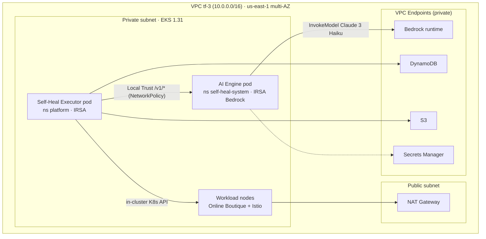

# Security Design - Task Force 3 · CDO-02

<!-- Doc owner: Nhóm CDO-02
     Status: Draft (W11 T4) → Final (W11 T6) → Refined (W12 T4)
     Word target: 1200-2000 từ
     Scope: DevOps-level security (network, IAM, secrets, encryption, audit, K8s).
     Out of scope: app-level authN/authZ deep, STRIDE, SIEM, Security Control Matrix. -->

> **📌 Scope**: focus vào những gì DevOps thực sự cấu hình + deploy cho platform self-heal. Không phải security audit enterprise đầy đủ.
> Nguyên tắc xuyên suốt: **least-privilege + zero unsafe action + tamper-evident audit + tenant isolation**. Bám 3 contracts trong [`../contract-review-notes.md`](../contract-review-notes.md).

---

## 1. Network Security

### 1.1 Network Diagram

*Caption: **CDO-02 tự host AI engine như pod trong EKS** (ns `self-heal-system`, ADR-008); engine gọi **Bedrock qua IRSA** (chỉ `bedrock:InvokeModel`, không quyền EKS). Executor (ns `platform`) gọi engine qua **service DNS nội bộ** (`/v1/*` decide-only), và là bên DUY NHẤT chạm K8s workload (ADR-007). Không cần ALB internal xuyên VPC. AWS service traffic qua VPC endpoint.*

### 1.2 Security Groups

| SG name | Inbound | Outbound | Attached to |
|---|---|---|---|
| `tf-3-eks-node-sg` | từ control plane + trong cluster (intra-VPC) | 443 to VPC endpoints (Bedrock/SecretsMgr/DynamoDB/S3) | EKS nodes (engine + executor pod) |

> Engine + executor đều là **pod trong cluster** (ADR-008) → gọi nhau qua ClusterIP, không cần SG riêng/ALB. Cô lập engine↔workload bằng **NetworkPolicy** (engine chỉ nhận từ ns `platform`), không bằng SG. Egress engine giới hạn ở **Bedrock endpoint** (IRSA + NetworkPolicy), **không tới EKS API**.

> Mọi nguồn khác: **deny by default** (deployment contract §6.B).

### 1.3 VPC Endpoints + NetworkPolicy

- VPC endpoint: Bedrock, Secrets Manager, DynamoDB, S3, EKS API → traffic private, không qua Internet.
- **K8s NetworkPolicy deny-all default** mỗi namespace, chỉ allow intra-namespace + Istio control plane → chặn cross-tenant traffic (xem §6).

---

## 2. IAM & Access Control

### 2.1 Service Roles (least-privilege)

| Role | Used by | Permissions |
|---|---|---|
| `tf-3-cdo2-ai-engine-bedrock-role` (IRSA) | AI engine pod (ns `self-heal-system`, ADR-008) | **chỉ** `bedrock:InvokeModel`(+stream) cho Claude 3 Haiku. **KHÔNG** EKS/K8s, **KHÔNG** dynamodb/s3. Cost cap $50/ngày (engine enforce) |
| `tf-3-cdo2-executor-role` (IRSA) | Executor pod (in-cluster SA) | gọi engine endpoint qua **Local Trust in-cluster** (NetworkPolicy, KHÔNG SigV4); IRSA chỉ cho `dynamodb:*Item` (idempotency table) + `s3:PutObject` (audit prefix tenant). **Không cần kubeconfig** (dùng in-cluster SA cho K8s) |
| `tf-3-cdo2-deploy-role` | CI/CD pipeline | EKS describe + Terraform apply + ECR push. **KHÔNG** `iam:*`, **KHÔNG** `s3:Delete*` audit bucket |
| `tf-3-cdo2-readonly-role` | Mentor/auditor review | CloudWatch Logs read, Athena query, S3 GetObject (audit), EKS read-only |

> Cấm tuyệt đối (mọi role): `iam:*` modify, `ec2:*` network modify (deployment contract §4 forbidden actions).

### 2.2 K8s RBAC (per-tenant namespace - ADR-002)

ServiceAccount `tf3-cdo-controller` (1 controller SA, ns `platform` — tên theo deployment-contract **§3.D**; giữ ở `platform` theo ADR-001/007, kết nối engine qua NetworkPolicy `namespaceSelector=platform`). Role tạo **per tenant-namespace** (KHÔNG ClusterRole), bind controller SA này. Manifest: [`../manifests/platform/executor-rbac.yaml`](../manifests/platform/executor-rbac.yaml).

| Resource | Verbs | Mục đích |
|---|---|---|
| `deployments` (apps) | get, list, **patch** | `RESTART_DEPLOYMENT` / `PATCH_MEMORY_LIMIT` / `ROLLOUT_UNDO` (KHÔNG `delete`) |
| `deployments/scale` (apps) | get, patch | `SCALE_REPLICAS` |
| `replicasets` (apps) | get, list | xác định revision cho `ROLLOUT_UNDO` |
| `pods`, `pods/log` ("") | get, list, patch / get | kiểm tra trạng thái + lấy log cho context bundle (KHÔNG `delete` — DELETE_POD bị cấm) |
| `secrets` ("") | get, create, delete | **chỉ** `ROTATE_SECRET` |

> **Explicit-deny (§3.D)**: KHÔNG `delete` deployment/namespace · KHÔNG verb trên `kube-system` · KHÔNG `clusterroles`/`clusterrolebindings` (chống privilege-escalation) · KHÔNG `replicas: 0` (executor enforce `replicas ≥ 1` ở [`guardrails.check_action_policy`]) · KHÔNG ClusterAdmin. → "Zero unsafe action". Executor đụng tenant A dùng SA scope A, RBAC chặn namespace B (defense-in-depth blast-radius).

### 2.3 Safety gate — CDO tự ENFORCE (không chỉ nhận config engine)

Engine chỉ *gợi ý*; CDO mới là bên **chặn cứng**. Executor check tuần tự trước khi Execute, vi phạm → Escalate (zero unsafe action):

| Lớp | Kiểm tra | Vi phạm → |
|---|---|---|
| Confidence gate | `confidence < 0.6` (engine spec §5.4) | escalate `low_confidence` |
| Blast-radius + allowlist | namespace ∈ `allowed_namespaces`; impact ≤ `max_pod_impact_pct` (default-deny) | escalate `blast_radius_violation` |
| **Action allow-list** | chỉ 5 action `{RESTART_DEPLOYMENT, PATCH_MEMORY_LIMIT, SCALE_REPLICAS, ROLLOUT_UNDO, ROTATE_SECRET}`. **`DELETE_POD` bị CDO cấm** | escalate `action_policy_violation` |
| **Forbidden namespaces** | deny CỨNG `kube-system/kube-public/kube-node-lease/observability/argocd/self-heal-system/platform` (gộp thêm `forbidden_namespaces` engine trả) | escalate `action_policy_violation` |
| Payload guard | telemetry_window ≤ ~4000 token (engine spec §6) — vượt thì trim datapoint cũ | log `telemetry_trim` |
| Idempotency | DynamoDB conditional write, trùng key → 409 | skip `DUPLICATE_SKIPPED` |
| Circuit breaker | error-rate sliding window > ngưỡng | halt |

> **Forbidden-namespace là deny-list CỨNG phía CDO** — không phụ thuộc engine gửi đúng. Engine bảo làm trên `kube-system` thì CDO vẫn chặn. Đây là điểm an toàn "defense-in-depth" để khoe lúc chấm.

**pattern_type — 2 đường thực thi (ai-api §3.2):**
- `urgent` (Path B): executor apply **trực tiếp** K8s API ngay (RTO thấp).
- `deferred` (Path A): executor **KHÔNG ghi thẳng cluster** — tạo **PR GitOps** (manifest/Helm), ArgoCD sync sau.

---

## 3. Secrets Management

### 3.1 Inventory

| Secret | Storage | Rotation | Accessed by |
|---|---|---|---|
| `ALERT_WEBHOOK_JWT` (bearer) | Secrets Manager `tf-3/cdo-2/webhook` | manual | alert webhook receiver |
| `SLACK_WEBHOOK_URL` | Secrets Manager `tf-3/cdo-2/slack` | manual | executor (escalation) |

> **Không còn kubeconfig secret** — executor thực thi K8s qua **in-cluster ServiceAccount token** (ADR-007); AI không giữ kubeconfig.
> Auth executor→engine = **Local Trust in-cluster + K8s NetworkPolicy** (contract 25/06, KHÔNG SigV4 cho call in-cluster); alert→receiver dùng JWT bearer. IAM SigV4 chỉ còn cho AWS services (qua IRSA). Istio mTLS *trong mesh* (bonus).

### 3.2 Inject pattern + anti-leak

- Executor pod lấy secret AWS qua **IRSA** (no static key); secret K8s qua ESO — **không hardcode**.
- K8s: External Secrets Operator (ESO) sync Secrets Manager → K8s Secret nếu cần.
- **gitleaks/TruffleHog** scan trên PR, block merge nếu lộ secret.
- Application log redact regex `Bearer .*` → `[REDACTED]`.

---

## 4. Encryption

### 4.1 At Rest

| Data | Storage | Key | Notes |
|---|---|---|---|
| Audit log | S3 `tf-3-aiops-audit-trail` | CMK `tf-3-audit-cmk` | Object Lock Compliance 90d (ADR-004) |
| Idempotency lock | DynamoDB | AWS-managed | encryption mặc định ON |
| EKS secrets | etcd | KMS envelope encryption | bật secrets encryption khi tạo cluster |
| EBS node volume | EKS node | AWS-managed | default encryption ON |

### 4.2 In Transit

- ALB engine: TLS 1.2+ (`ELBSecurityPolicy-TLS13-1-2-2021-06`).
- Service-to-service trong mesh: **Istio mTLS STRICT**.
- Bedrock / Secrets Manager / S3 / DynamoDB: HTTPS qua VPC endpoint.

### 4.3 Key Management

- CMK audit: rotation 1 năm; key policy chỉ allow `tf-3-cdo2-*-role`, deny còn lại.
- CloudTrail data event ON cho audit CMK + audit bucket.

---

## 5. Audit Logging

### 5.1 What to log

- **Self-heal cycle**: mỗi bước executor (detect/decide/guardrail/execute/verify/escalate) ghi: `ts`, `tenant_id`, `correlation_id`, `idempotency_key`, action type + params, blast-radius check result, dry_run_mode, verify outcome, `next_action`, model confidence, latency.
- **Infra change**: CloudTrail management events (Terraform apply, EKS update).
- **K8s API**: audit policy bật cho mutation trong namespace tenant.

### 5.2 Storage + Retention

| Log type | Storage | Retention | Query |
|---|---|---|---|
| Self-heal audit | S3 Object Lock + Athena | 90d hot, 1y cold | Athena SQL |
| CloudTrail | S3 | 90d | CloudTrail console |
| App/executor log | CloudWatch Logs | 14d | Logs Insights |
| K8s audit | CloudWatch Logs | 30d | Logs Insights |

- Audit phân **prefix per-tenant** (`audit/tnt-a/`, `audit/tnt-b/`), IAM chặn cross-prefix.

### 5.3 PII scrubbing + Malformed telemetry (telemetry contract §2.5)

Telemetry contract (FREEZE) giao **CDO chịu trách nhiệm** xử lý dữ liệu ở ingestion layer **trước khi** gửi sang AI Engine:

**A. PII / secret scrubbing (SOC2)** — bắt buộc vì `application_log_event` đẩy raw stack trace (dễ lẫn token/password/connection string), mà audit lưu WORM 90 ngày → lưu PII bất biến = vi phạm SOC2.
- Tín hiệu `application_log_event`: chạy bộ lọc regex xoá/ẩn danh `Bearer .*`, password, connection string, email/phone/card trong `value` (stack trace) **trước khi** emit.
- `pod_name`/`container`: chỉ dùng tên tài nguyên hệ thống chuẩn, cấm tên/email người dùng.
- Scrubbing chạy ở **CDO ingestion**, không đẩy trách nhiệm sang AI. ≥1 unit test demo redaction.

**B. Malformed telemetry → Dead-Letter Queue (DLQ)**
- Validate mỗi datapoint theo JSON Schema telemetry contract §3 ở ingestion.
- Payload sai schema/thiếu field/sai kiểu → AI Engine từ chối `400` (demo FastAPI trả `422`; executor map **cả 400 và 422** → `EngineBadRequest`).
- CDO route bản ghi bị từ chối vào **DLQ riêng** (SQS) để phân tích; **alert nếu tỉ lệ malformed > 0.5% / 5 phút** (telemetry §2.5.B).

---

## 6. Container & K8s Security

- **Pod Security Standard `restricted`** cho namespace tenant.
- **NetworkPolicy deny-all default** + explicit allow intra-namespace + Istio control plane → chặn cross-tenant.
- **IRSA** cho ServiceAccount executor (no static AWS key trong pod).
- **Image scan Trivy** trong CI, fail-on HIGH/CRITICAL.
- **Istio mTLS STRICT** mode trong mesh.
- Executor RBAC least-privilege (xem §2.2); không privileged container.

---

## 7. Compliance Touchpoints

| Standard | Controls (capstone scope) |
|---|---|
| SOC2 Type II | CC6.1 (logical access via IAM + RBAC least-priv) · CC7.2 (monitoring via CloudWatch + audit) · CC8.1 (change mgmt via Git + CI/CD + audit trail) |
| GDPR-style | Article 32: encryption at rest + in transit, access control; tenant data deletion theo prefix |

Map ở mức "control → AWS service được dùng" là đủ cho capstone.

---

## 8. Open Questions

- [x] Q0 (RESOLVED): AI có giữ kubeconfig/EKS access không → **Không** (ADR-007). Contract FREEZE xác nhận: deployment §3.A.2/§3.D cấm `eks:*`+kubeconfig, §5.B egress không mở EKS API.
- [x] Q1 (RESOLVED): Verify window — **engine quyết** qua `verify_policy.window_seconds` trả trong `/v1/decide` response (ai-api §3.2); executor fallback CFG nếu thiếu. (đóng P4)
- [x] Q2 (RESOLVED): tenant routing = **cdo-2 UUID `6c8b4b2b-4d45-4209-a1b4-4b532d56a31c`** (deployment §2.C) cho `X-Tenant-Id` + prefix audit S3. (telemetry datapoint `tenant_id` per-customer là field riêng trong payload.)
- [ ] Q3: K8s audit policy mức nào đủ cho SOC2 demo (chỉ mutation hay full)?

---

## Related documents

- [`02_infra_design.md`](02_infra_design.md) - network diagram + kiến trúc nguồn của doc này
- [`04_deployment_design.md`](04_deployment_design.md) - CI/CD security gates (gitleaks, Trivy, OIDC)
- [`08_adrs.md`](08_adrs.md) - ADR-002 (isolation), ADR-004 (audit Object Lock)
- [`../contract-review-notes.md`](../contract-review-notes.md) - RBAC/secrets/network bám deployment contract §3-§6
