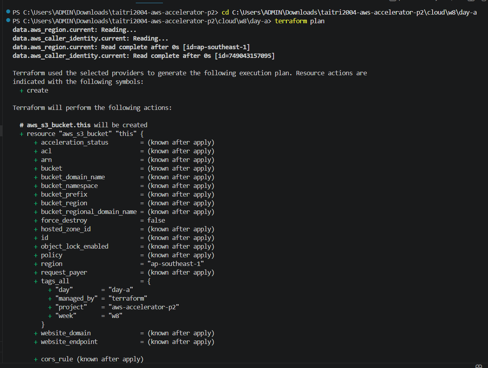
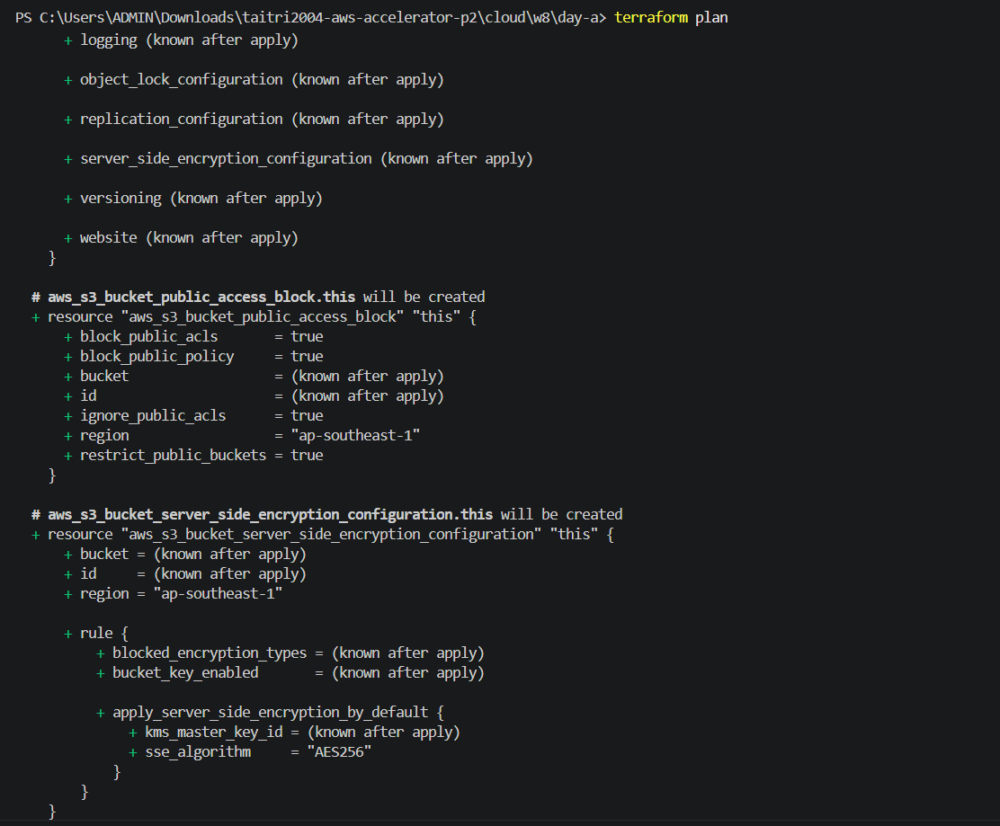
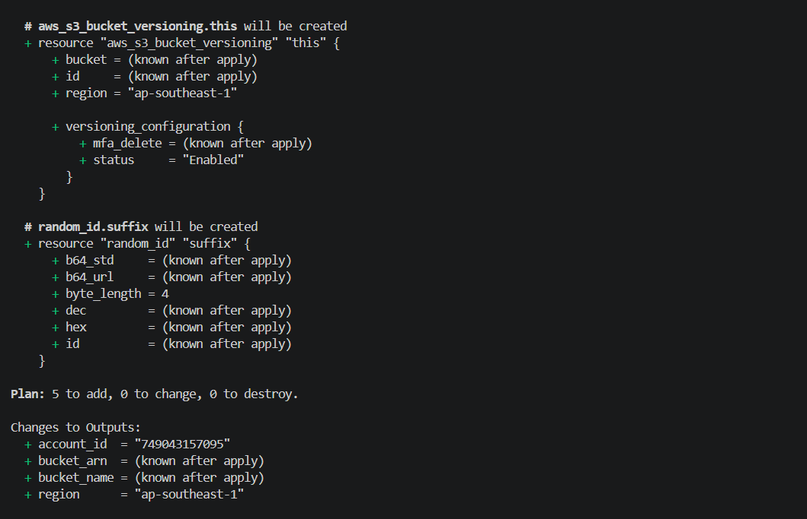
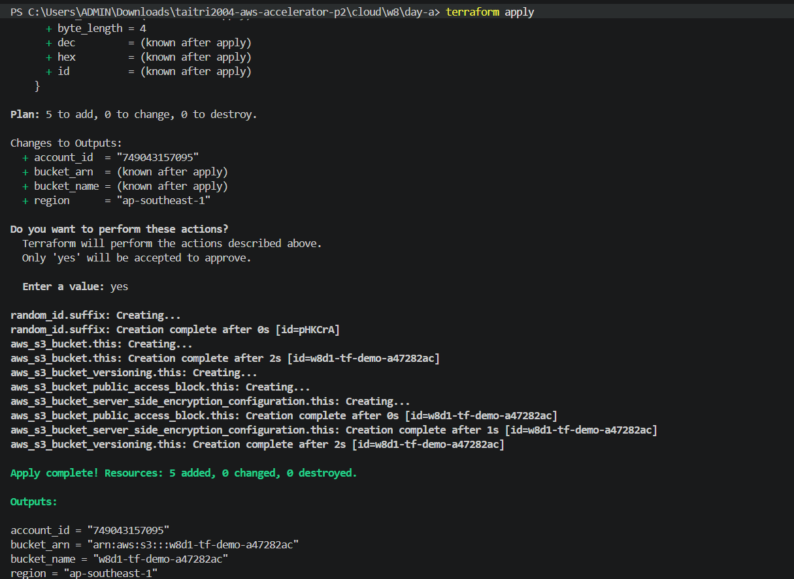
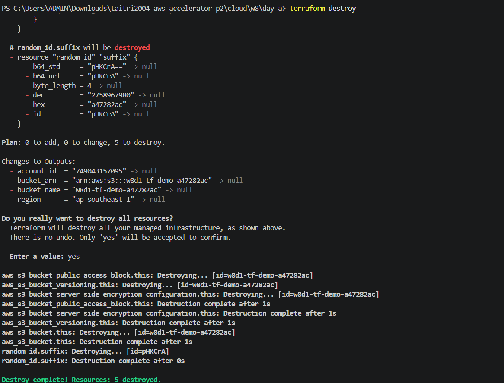
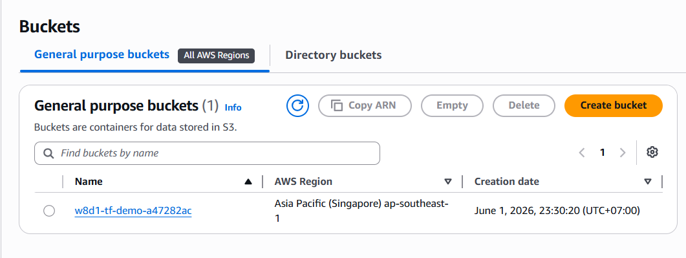
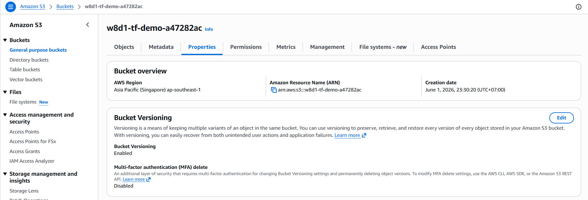
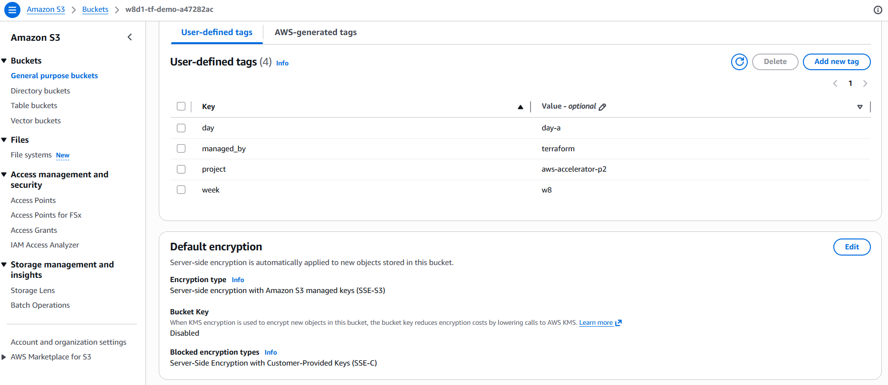
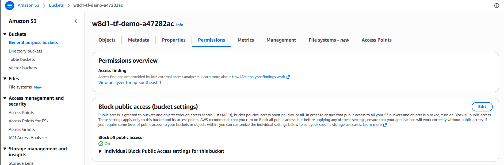

# W8-D1 Notes - Terraform (IaC + HCL) trên AWS

> Ngày: 01/06/2026 (T2). Self-study Terraform phần 1.
> Lab: tạo một S3 bucket có cấu hình an toàn mặc định trên AWS.
> Account: 749043157095. Region: ap-southeast-1.

## 1. IaC là gì? Vì sao cần?

IaC (Infrastructure as Code) là cách quản lý hạ tầng bằng code thay vì thao tác thủ công trên console. File Terraform có thể được commit lên Git, review được thay đổi, chạy lại được ở môi trường khác và dễ audit hơn so với việc tạo resource bằng tay.

Với IaC, mình mô tả trạng thái mong muốn của hạ tầng trong code. Khi cần thay đổi, mình sửa code rồi dùng `terraform plan` để xem trước tác động, sau đó mới `apply`. Cách làm này giúp giảm lỗi thao tác thủ công và tạo thói quen kiểm tra trước khi thay đổi resource thật.

## 2. Declarative vs Imperative

Terraform theo hướng declarative: mình khai báo hạ tầng cần có, Terraform tự tính toán cần tạo, sửa hay xóa resource nào để đạt trạng thái đó. Ví dụ trong bài này, mình khai báo cần có một S3 bucket, versioning, encryption và public access block.

Imperative là cách viết từng bước phải làm, ví dụ "tạo bucket", "bật versioning", "bật encryption". Declarative phù hợp với hạ tầng hơn vì mình tập trung vào trạng thái cuối cùng và dễ so sánh drift giữa code với thực tế.

## 3. Idempotency

Idempotency nghĩa là chạy lại cùng một cấu hình nhiều lần thì kết quả vẫn ổn định. Nếu resource đã đúng với code, lần `terraform plan` tiếp theo sẽ không cần thay đổi gì.

Điều này quan trọng với automation vì pipeline có thể chạy lặp lại mà không tạo trùng resource hoặc làm thay đổi ngoài ý muốn. Terraform cần state để biết resource nào đang được quản lý và so sánh với cấu hình hiện tại.

## 4. Core workflow

| Lệnh | Làm gì | Ghi chú |
|---|---|---|
| `terraform init` | Tải provider và tạo `.terraform.lock.hcl` | Cần chạy đầu tiên trong folder Terraform. Provider đã dùng: `hashicorp/aws` và `hashicorp/random`. |
| `terraform fmt` | Format file `.tf` | Nên chạy trước khi commit để code dễ đọc và thống nhất. |
| `terraform validate` | Kiểm tra cú pháp và cấu trúc cấu hình | Lệnh này đã báo configuration valid. |
| `terraform plan` | Xem trước thay đổi | Plan hiện tại tạo 5 resource, không sửa và không xóa resource nào. |
| `terraform apply` | Tạo resource thật trên AWS | Chỉ chạy sau khi đã review plan và chấp nhận chi phí/rủi ro. |
| `terraform destroy` | Xóa resource Terraform đang quản lý | Dùng sau lab nếu không cần giữ resource để tránh để sót tài nguyên. |

## 5. Các block HCL đã dùng trong main.tf

- `terraform {}` + `required_providers`: pin Terraform version và provider version. `~> 6.0` cho AWS provider nghĩa là chấp nhận các bản 6.x phù hợp, nhưng không tự động nhảy sang major version 7.
- `provider "aws"` + `default_tags`: cấu hình region deploy và gắn tag mặc định cho resource. Credentials được lấy từ AWS CLI/profile trên máy.
- `data "aws_caller_identity"` và `data "aws_region"`: đọc thông tin có sẵn từ AWS, không tạo resource mới. Trong plan, hai data source này giúp biết account id và region.
- `random_id`: tạo hậu tố ngẫu nhiên để tên S3 bucket không bị trùng, vì bucket name phải unique toàn cầu.
- `aws_s3_bucket`: tạo bucket chính cho lab.
- `aws_s3_bucket_versioning`: bật versioning để giữ lịch sử object nếu sau này upload file.
- `aws_s3_bucket_server_side_encryption_configuration`: bật server-side encryption mặc định bằng AES256.
- `aws_s3_bucket_public_access_block`: chặn public ACL và public bucket policy để bucket không public ngoài ý muốn.
- `variable` + `validation`: tách tham số region/bucket base name ra khỏi resource và kiểm tra tên bucket chỉ chứa ký tự hợp lệ.
- `output`: in ra bucket name, bucket ARN, account id và region sau khi apply.

## 6. Reference và dependency

Terraform tự suy ra thứ tự tạo resource dựa trên reference. Ví dụ `aws_s3_bucket_versioning.this` dùng `aws_s3_bucket.this.id`, nên Terraform biết phải tạo bucket trước rồi mới bật versioning.

Trong bài này, versioning, encryption và public access block đều phụ thuộc vào bucket. `random_id.suffix.hex` cũng được dùng trong tên bucket, nên `random_id` phải có trước khi tạo bucket.

## 7. State

Terraform state là file ghi lại mapping giữa code và resource thật trên AWS. Nếu không có state, Terraform sẽ không biết resource nào đã được tạo và đang thuộc về cấu hình nào.

State không nên commit lên Git vì có thể chứa metadata nhạy cảm và có thể gây xung đột khi nhiều người cùng thao tác. Với project team, nên dùng remote state, ví dụ S3 backend kèm lock để tránh hai người apply cùng lúc.

Trong bài lab cá nhân này, state local là đủ để thực hành, nhưng `.gitignore` đã loại `*.tfstate`, `*.tfstate.*` và `.terraform/` để tránh commit nhầm.

## 8. Quan sát khi chạy thực tế

- `terraform plan` báo `Plan: 5 to add, 0 to change, 0 to destroy`.
- 5 resource sẽ được tạo: `random_id.suffix`, `aws_s3_bucket.this`, `aws_s3_bucket_versioning.this`, `aws_s3_bucket_server_side_encryption_configuration.this`, `aws_s3_bucket_public_access_block.this`.
- `account_id = "749043157095"` và `region = "ap-southeast-1"` biết được ngay trong plan vì Terraform đọc từ data sources.
- `bucket_name` và `bucket_arn` là `(known after apply)` vì tên bucket phụ thuộc vào random suffix, giá trị này chỉ có sau khi resource `random_id` được tạo.
- Bucket rỗng gần như không phát sinh chi phí đáng kể, nhưng vẫn nên `destroy` sau lab nếu không cần giữ lại evidence trên AWS.

## 9. Câu hỏi để hỏi mentor

1. Khi nào nên dùng SSE-S3 (`AES256`) và khi nào nên dùng SSE-KMS cho S3 bucket?
2. Với team project, nên thiết kế remote state và state locking như thế nào để tránh conflict?
3. Nên tách Terraform thành module từ thời điểm nào: ngay khi có resource đầu tiên hay khi bắt đầu lặp lại pattern?

## 10. Lệnh đã chạy

```powershell
terraform init
terraform fmt
terraform validate
terraform plan
terraform apply
terraform destroy
```

Kết quả kiểm tra:

```text
terraform validate
Success! The configuration is valid.

terraform plan
Plan: 5 to add, 0 to change, 0 to destroy.

terraform apply
Apply complete! Resources: 5 added, 0 changed, 0 destroyed.

terraform destroy
Destroy complete! Resources: 5 destroyed.

Outputs sau khi apply:
account_id  = "749043157095"
bucket_arn  = "arn:aws:s3:::w8d1-tf-demo-a47282ac"
bucket_name = "w8d1-tf-demo-a47282ac"
region      = "ap-southeast-1"
```

## 11. Evidence screenshots

Terraform plan:







Terraform apply:



Terraform destroy:



AWS S3 bucket:



S3 bucket versioning:



S3 default encryption:



S3 public access block:



## 12. Kiểm tra sau apply

Sau khi `terraform apply`, đã kiểm tra trên AWS Console:

- S3 bucket đã được tạo đúng region `ap-southeast-1`.
- Versioning đang `Enabled`.
- Default encryption đang bật.
- Block public access đang bật đầy đủ.

Sau khi chụp evidence, đã chạy `terraform destroy` để xóa các resource của lab.
