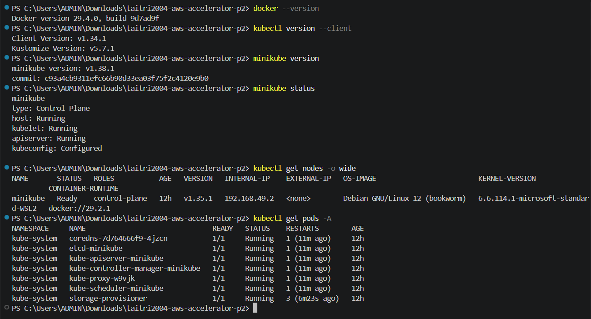
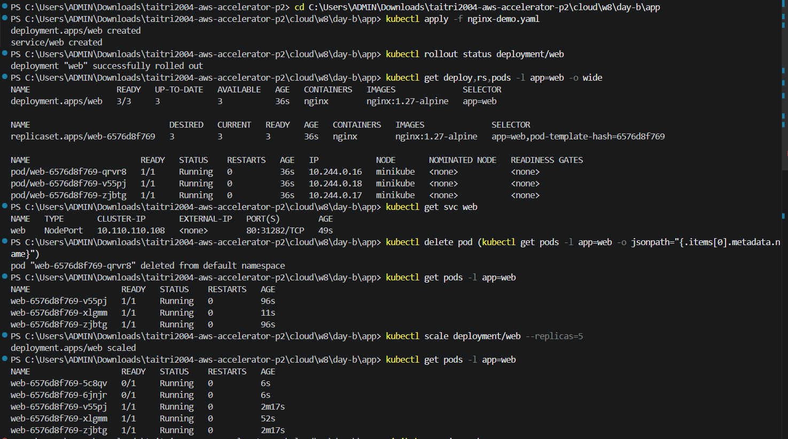
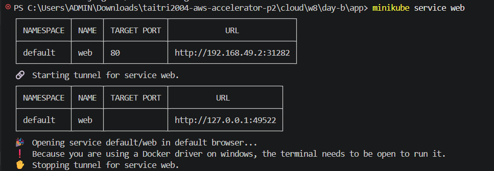
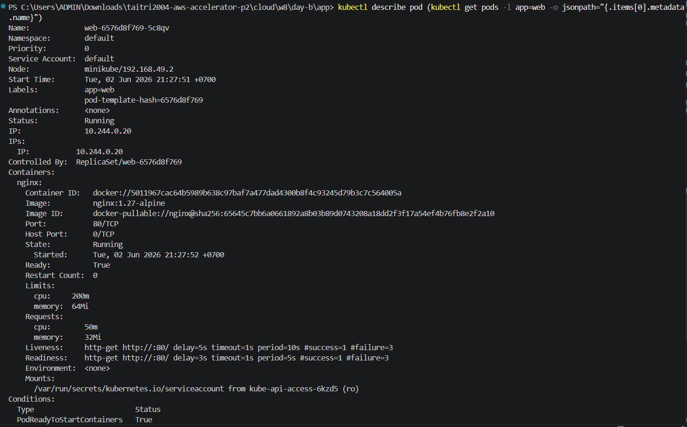
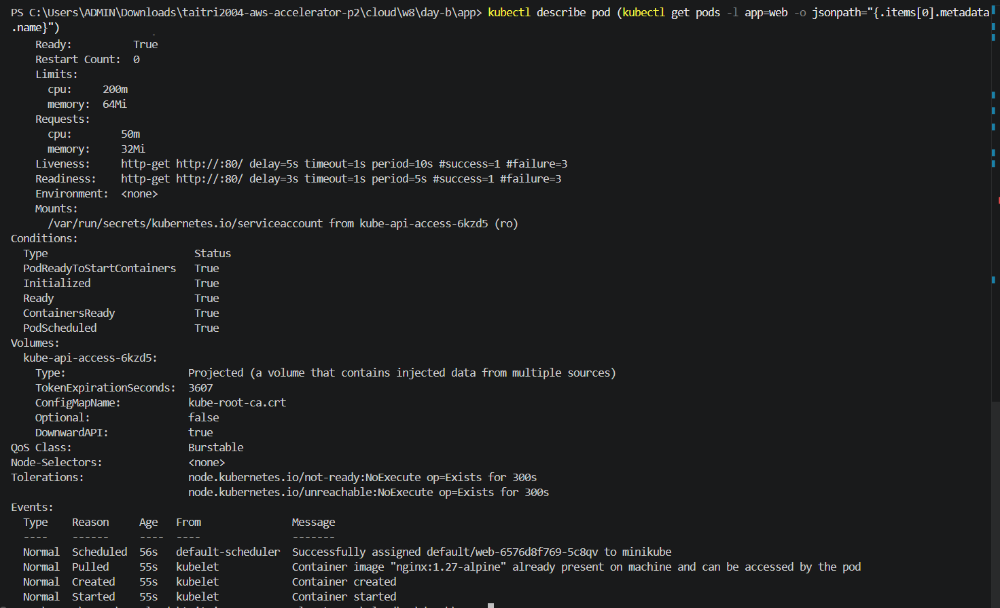

# W8-D2 Notes - Kubernetes Foundation

> Ngày: 02/06/2026 (T3). Self-study K8s để chuẩn bị cho buổi onsite T5.
> Scope hôm nay: đọc nền Container/Orchestration, hiểu các object cơ bản và cài sẵn Docker Desktop, kubectl, minikube.

## 0. Setup môi trường

Các tool đã cài và kiểm tra:

- Docker: `Docker version 29.4.0`
- kubectl client: `v1.34.1`
- minikube: `v1.38.1`
- Kubernetes server trong minikube: `v1.35.1`
- Current context: `minikube`
- Node local: `minikube` ở trạng thái `Ready`

Lệnh đã chạy:

```powershell
docker --version
kubectl version --client
minikube version
minikube update-context
minikube start --driver=docker
minikube status
kubectl config current-context
kubectl get nodes -o wide
kubectl get pods -A
```

Kết quả kiểm tra chính:

```text
minikube status
host: Running
kubelet: Running
apiserver: Running
kubeconfig: Configured

kubectl config current-context
minikube

kubectl get nodes -o wide
NAME       STATUS   ROLES           VERSION
minikube   Ready    control-plane   v1.35.1

kubectl get pods -A
CoreDNS, etcd, kube-apiserver, kube-controller-manager, kube-scheduler,
kube-proxy và storage-provisioner đều Running.
```

## 1. Container vs VM

Container đóng gói application cùng dependency cần thiết để chạy nhất quán giữa các môi trường. Container nhẹ hơn VM vì nó chia sẻ kernel với host, còn VM thường ảo hóa cả hệ điều hành riêng nên nặng hơn và khởi động chậm hơn.

Hai khái niệm nền của container:

- Namespaces: cô lập góc nhìn của process, ví dụ process, network, filesystem.
- cgroups: giới hạn và theo dõi tài nguyên như CPU, memory.

Docker giúp build image, chạy container và quản lý lifecycle container ở mức một máy. Khi số lượng container và node tăng lên, cần orchestration để vận hành ổn định hơn.

## 2. Vì sao cần orchestration

Nếu chỉ chạy một vài container local thì `docker run` hoặc Docker Compose có thể đủ. Nhưng khi chạy nhiều service trên nhiều node, cần một hệ thống tự động xử lý scheduling, self-healing, rollout, scaling và service discovery.

Kubernetes giải quyết phần orchestration bằng cách cho mình khai báo desired state. Ví dụ: cần 3 replicas của một app, expose qua Service, có health check. Kubernetes sẽ cố gắng đưa trạng thái thực tế về đúng trạng thái đã khai báo.

## 3. Kiến trúc cluster

- Control plane: gồm API server, etcd, scheduler và controller-manager. Đây là phần điều phối cluster.
- Worker node: chạy workload thật, gồm kubelet, kube-proxy và container runtime.
- API server: điểm vào chính của cluster; `kubectl` nói chuyện với API server.
- etcd: lưu trạng thái cluster.
- scheduler: chọn node phù hợp để đặt Pod.
- controller-manager: chạy các controller để so sánh desired state với actual state.
- kubelet: agent trên node, nhận PodSpec và đảm bảo container chạy đúng.
- kube-proxy: hỗ trợ networking cho Service.
- container runtime: chạy container, ví dụ Docker/containerd.

Mental model: mình dùng `kubectl` gửi manifest hoặc command vào API server. API server ghi trạng thái mong muốn vào etcd. Scheduler và controller xử lý để tạo Pod, gán node và giữ trạng thái thực tế khớp với mong muốn.

## 4. Pod

Pod là đơn vị deploy nhỏ nhất trong Kubernetes. Một Pod có thể chứa một hoặc nhiều container dùng chung network namespace và có thể chia sẻ volume.

Các container trong cùng Pod có chung IP và có thể gọi nhau qua `localhost`. Tuy nhiên Pod là ephemeral: nếu Pod chết và được tạo lại, IP có thể thay đổi. Vì vậy không nên gọi Pod trực tiếp trong production; nên dùng Service để có endpoint ổn định.

## 5. Workload controllers

| Object | Dùng khi nào |
|---|---|
| Deployment | Dùng cho stateless app cần rolling update, rollback và quản lý replicas. Đây là object phổ biến nhất khi deploy web/API service. |
| ReplicaSet | Đảm bảo số lượng Pod replicas đúng như mong muốn. Thường không tạo trực tiếp, vì Deployment sẽ quản lý ReplicaSet. |
| StatefulSet | Dùng cho app stateful cần identity ổn định, storage ổn định hoặc thứ tự start/stop rõ ràng, ví dụ database. |
| DaemonSet | Chạy một Pod trên mỗi node hoặc một nhóm node, ví dụ log agent, monitoring agent, CNI plugin. |
| Job | Chạy task một lần đến khi hoàn thành, ví dụ migration hoặc batch processing. |
| CronJob | Chạy Job theo lịch, ví dụ cleanup hằng ngày hoặc report định kỳ. |

## 6. Service và Networking

Service cần thiết vì Pod IP không ổn định. Service tạo một virtual endpoint ổn định để client gọi vào, sau đó route traffic đến các Pod match label selector.

Các loại Service cơ bản:

- ClusterIP: chỉ truy cập trong cluster, phù hợp cho service nội bộ.
- NodePort: mở một port trên node để truy cập từ bên ngoài cluster; hay dùng trong lab/minikube.
- LoadBalancer: yêu cầu cloud provider tạo load balancer bên ngoài; thường dùng trên AWS/GCP/Azure.

CoreDNS cung cấp service discovery trong cluster. Pod có thể gọi service bằng DNS name thay vì hard-code IP, ví dụ `my-service.default.svc.cluster.local`.

Ingress là cách expose HTTP/HTTPS ở layer 7. Ingress thường cần Ingress Controller như NGINX Ingress Controller để nhận request ngoài cluster và route theo host/path vào Service phù hợp.

## 7. Probes

- livenessProbe: kiểm tra app còn sống không. Nếu fail, kubelet restart container.
- readinessProbe: kiểm tra app đã sẵn sàng nhận traffic chưa. Nếu fail, Pod bị gỡ khỏi endpoint của Service nhưng không bị restart.
- startupProbe: dùng cho app khởi động chậm. Trong lúc startupProbe chưa pass, liveness/readiness có thể được trì hoãn để tránh restart quá sớm.

Phân biệt quan trọng: liveness xử lý "app bị kẹt/chết", readiness xử lý "app chưa sẵn sàng nhận request".

## 8. ConfigMap và Secret

ConfigMap dùng để lưu cấu hình không nhạy cảm, ví dụ app mode, feature flag, URL service nội bộ.

Secret dùng cho dữ liệu nhạy cảm hơn như password, token, certificate. Tuy nhiên Secret mặc định chỉ được encode base64, không phải tự động mã hóa mạnh ở mọi nơi. Khi dùng production cần quan tâm encryption at rest, RBAC và cách rotate secret.

Có hai cách inject phổ biến vào Pod:

- Environment variables.
- Mount thành file trong volume.

## 9. NetworkPolicy

NetworkPolicy giống firewall ở tầng Pod. Nó cho phép định nghĩa Pod nào được nói chuyện với Pod nào, theo namespace, label, port và direction ingress/egress.

Mặc định nhiều cluster cho phép Pod giao tiếp tự do. Khi áp dụng NetworkPolicy, có thể chuyển sang mô hình hạn chế hơn như default deny rồi mở từng rule cần thiết.

NetworkPolicy chỉ có hiệu lực nếu CNI plugin hỗ trợ, ví dụ Calico hoặc Cilium. Với lab minikube, cần kiểm tra CNI đang dùng trước khi kỳ vọng NetworkPolicy hoạt động đầy đủ.

## 10. Câu hỏi để hỏi mentor Nghĩa

1. Trong thực tế nên chọn readinessProbe và livenessProbe theo endpoint nào để tránh restart app sai?
2. Khi nào nên dùng NodePort trong lab, và khi nào nên chuyển sang Ingress hoặc LoadBalancer?
3. NetworkPolicy nên bắt đầu từ default deny ngay từ đầu hay thêm dần khi hệ thống đã ổn định?

## 11. Evidence screenshots

Ảnh dưới đây ghi lại các lệnh kiểm tra tool và cluster:

- `docker --version`
- `kubectl version --client`
- `minikube version`
- `minikube status`
- `kubectl get nodes -o wide`
- `kubectl get pods -A`



## 12. Demo nginx trên minikube

Ngoài phần cài đặt, mình thử deploy một app nginx đơn giản để nhìn rõ các khái niệm Deployment, ReplicaSet, Pod, Service, probes, self-healing và scaling.

Manifest demo: `app/nginx-demo.yaml`

Các object đã tạo:

- `Deployment/web`: chạy nginx `1.27-alpine` với 3 replicas.
- `ReplicaSet`: được Deployment tạo và quản lý.
- `Pod`: các Pod có label `app=web`.
- `Service/web`: type `NodePort`, expose port 80 của nginx.
- `readinessProbe` và `livenessProbe`: kiểm tra HTTP `/` trên port 80.
- `resources.requests/limits`: khai báo CPU/memory tối thiểu và tối đa cho container.

Lệnh đã thử:

```powershell
kubectl apply -f nginx-demo.yaml
kubectl rollout status deployment/web
kubectl get deploy,rs,pods -l app=web -o wide
kubectl get svc web
minikube service web
kubectl delete pod (kubectl get pods -l app=web -o jsonpath="{.items[0].metadata.name}")
kubectl get pods -l app=web
kubectl scale deployment/web --replicas=5
kubectl describe pod (kubectl get pods -l app=web -o jsonpath="{.items[0].metadata.name}")
```

Kết quả quan sát:

- Deployment tạo đủ 3 Pod ban đầu.
- Service `web` được expose bằng NodePort.
- Khi xóa một Pod, ReplicaSet tạo Pod mới để đưa số replicas về đúng desired state.
- Khi scale lên 5 replicas, Kubernetes tạo thêm Pod mới.
- `describe pod` thể hiện probes, resource requests/limits, trạng thái Ready và events của Pod.

Evidence:









## 13. Trạng thái cuối ngày

T3 đã hoàn tất phần cài đặt và đọc nền Kubernetes:

- Docker Desktop chạy được.
- kubectl kết nối được tới context `minikube`.
- minikube chạy bằng Docker driver.
- Node `minikube` ở trạng thái `Ready`.
- Các pod hệ thống trong `kube-system` đều `Running`.
- Đã thử demo nginx để kiểm tra Deployment, Service, probes, self-healing và scaling trên minikube.
