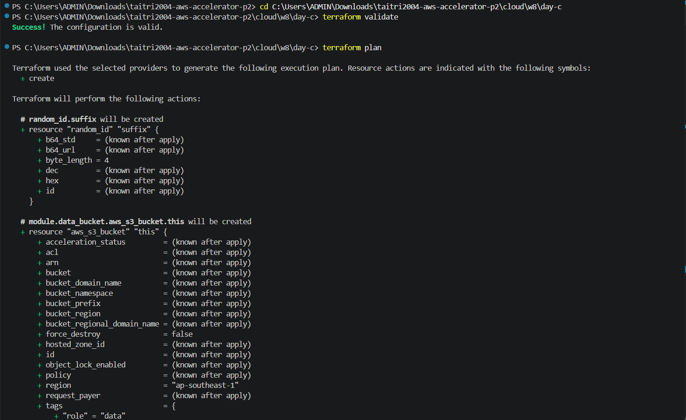
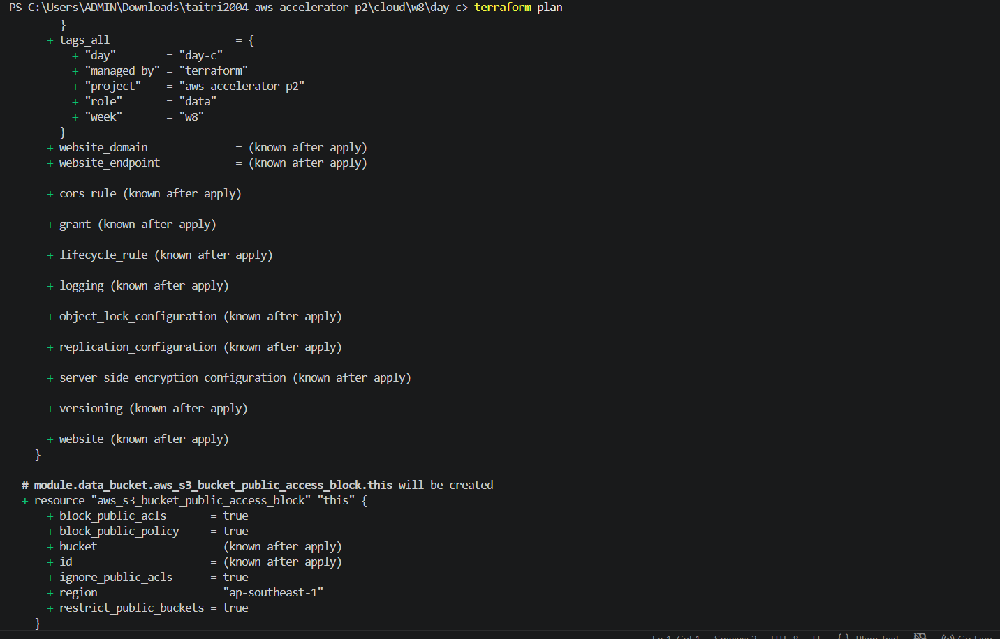
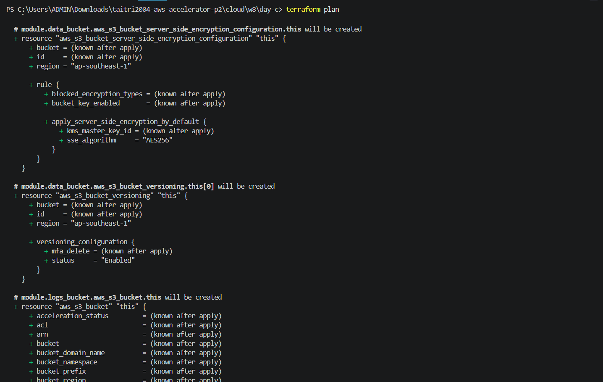
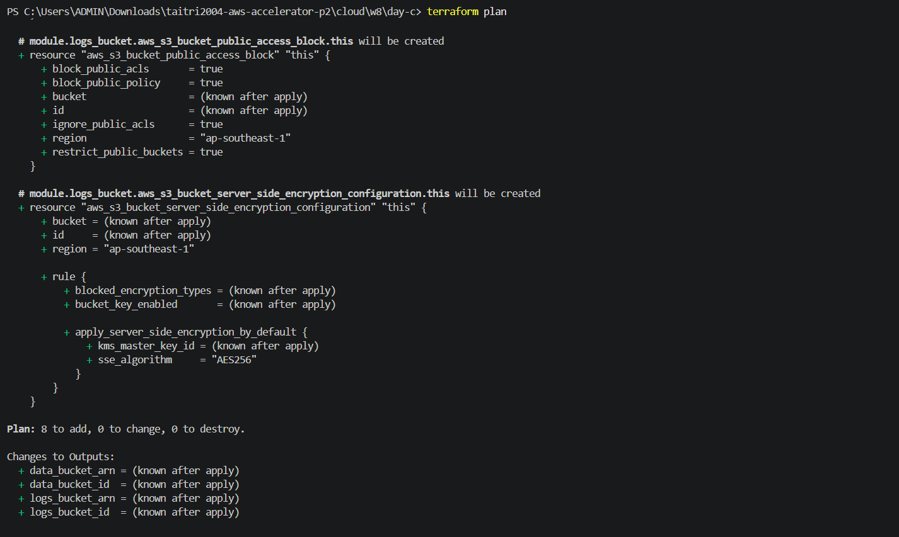
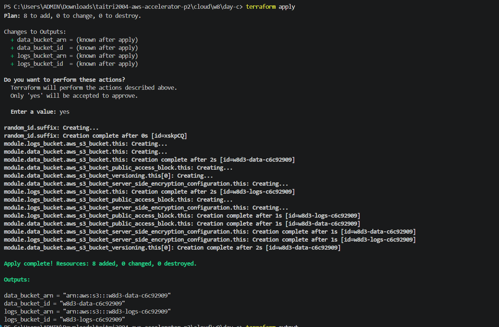
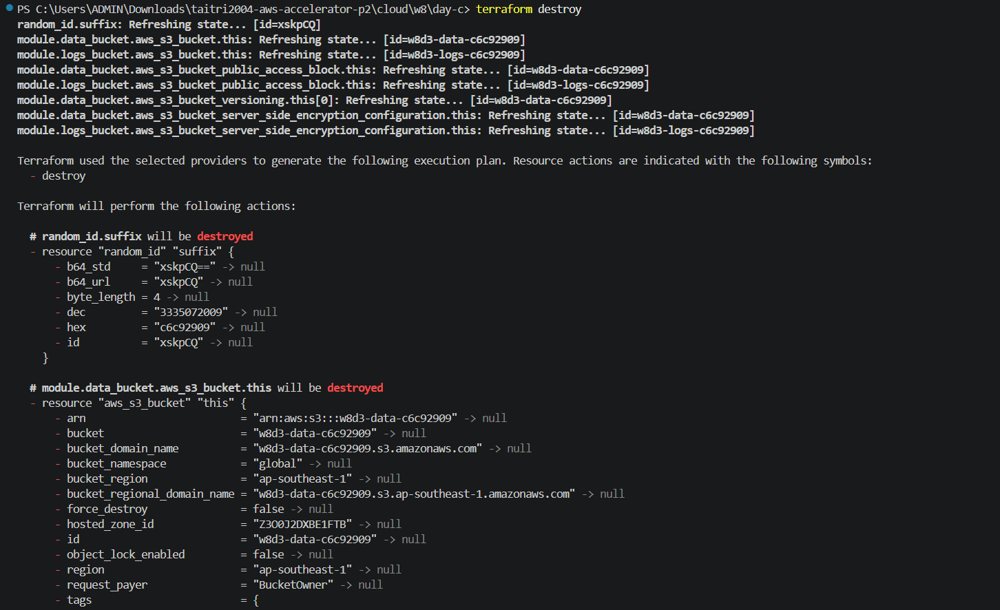
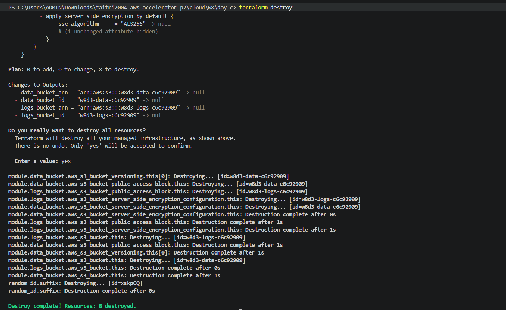

# W8-D3 Notes - Terraform phần 2

> Ngày: 03/06/2026 (T4). Self-study Terraform phần 2, live Terraform với mentor Minh và Online Test 1.
> Scope: State Management, Remote State, Modules, Best Practices, ADR.
> Tài liệu: `knowledge/w8-foundation-iac-k8s.md` mục Terraform và deck Terraform phần state/modules/best practices.

## 1. State Management

Terraform state là file ghi lại mapping giữa resource trong code và resource thật ngoài cloud. Ví dụ `aws_s3_bucket.this` trong code tương ứng với bucket nào trên AWS. Terraform cần state để biết resource nào đang được quản lý, so sánh desired state trong `.tf` với actual state và tính được plan cần tạo/sửa/xóa gì.

Remote state là lưu state ở backend dùng chung, ví dụ S3 backend. Team cần remote state để mọi người dùng cùng một source of truth thay vì mỗi máy có một state local khác nhau. Remote state cũng dễ bật versioning/backup hơn so với file local.

State locking dùng để tránh hai người hoặc hai pipeline `terraform apply` cùng lúc trên cùng một state. Nếu không lock, hai lần apply đồng thời có thể ghi đè state, gây race condition hoặc làm state lệch với resource thật.

Hai cách lock đã học:

- S3 + DynamoDB lock: cách phổ biến lâu nay, dùng DynamoDB table để giữ lock khi apply.
- S3 `use_lockfile` trong Terraform 1.10+: dùng file lock native trên S3, đơn giản hơn vì không cần DynamoDB table riêng.

Các lệnh state cần nhớ:

- `terraform state list`: liệt kê resource đang có trong state.
- `terraform state show <address>`: xem chi tiết một resource trong state.
- `terraform state mv <old> <new>`: đổi address trong state, thường dùng khi refactor code/module.
- `terraform state rm <address>`: bỏ resource khỏi state nhưng không xóa resource thật ngoài cloud.
- `terraform import`: đưa resource đã tồn tại ngoài cloud vào state để Terraform bắt đầu quản lý.

Drift là tình huống resource thật bị thay đổi ngoài Terraform, ví dụ sửa trực tiếp trên AWS Console. Có thể phát hiện drift bằng `terraform plan`; nếu actual state khác desired state, plan sẽ báo cần update hoặc recreate.

## 2. Modules

DRY là "Don't Repeat Yourself": tránh copy-paste cùng một pattern nhiều lần. Module giúp DRY bằng cách đóng gói một nhóm resource và expose input/output rõ ràng. Khi cần tạo nhiều resource cùng pattern, mình gọi lại module với input khác nhau thay vì lặp lại toàn bộ code.

Cấu trúc module cơ bản:

- `main.tf`: resource chính của module.
- `variables.tf`: input của module.
- `outputs.tf`: output module trả về cho caller.
- `README.md`: mô tả cách dùng, input/output và ví dụ. Lab này chưa có README, nhưng production module nên có.

Module trong lab: `modules/secure-bucket`.

Input:

- `bucket_name`: tên bucket S3.
- `enable_versioning`: bật/tắt versioning.
- `tags`: map tag riêng cho bucket.

Output:

- `bucket_id`: ID/tên bucket.
- `bucket_arn`: ARN của bucket.

Root module gọi `secure-bucket` hai lần:

- `module.data_bucket`: tạo bucket data, `enable_versioning = true`, tag `role = data`.
- `module.logs_bucket`: tạo bucket logs, `enable_versioning = false`, tag `role = logs`.

Khi gọi module hai lần, plan sẽ tạo hai bucket từ cùng một module. Vì data bucket bật versioning còn logs bucket tắt versioning, chỉ data bucket có resource `aws_s3_bucket_versioning`.

Ví dụ tham chiếu output module:

```hcl
module.data_bucket.bucket_id
module.data_bucket.bucket_arn
module.logs_bucket.bucket_id
module.logs_bucket.bucket_arn
```

## 3. Best Practices

Quản secret:

- Không hardcode access key, password, token trong `.tf`.
- Không commit `.tfvars` nếu file chứa giá trị nhạy cảm.
- Dùng biến môi trường, secret manager hoặc CI/CD secret store.
- Với biến nhạy cảm, khai báo `sensitive = true` để giảm khả năng bị in ra output/log.

`.gitignore` cho Terraform nên có:

```gitignore
.terraform/
*.tfstate
*.tfstate.*
crash.log
*.tfvars
```

Các lệnh kiểm tra:

- `terraform fmt -recursive`: format toàn bộ file Terraform, gồm cả module con.
- `terraform validate`: kiểm tra cấu hình có hợp lệ về cú pháp/schema không.
- `tflint`: kiểm tra sâu hơn về best practices, provider-specific rules và lỗi tiềm ẩn.

Tách môi trường:

- Cách đơn giản: dùng `dev.tfvars`, `staging.tfvars`, `prod.tfvars`.
- Cách rõ ràng hơn cho team: tách thư mục theo môi trường, ví dụ `envs/dev`, `envs/staging`, `envs/prod`.
- Dù chọn cách nào, state của từng môi trường nên tách riêng để tránh apply nhầm.

Version pinning provider quan trọng vì CI/CD cần chạy ổn định và có thể tái lập. Nếu không pin version, một lần provider update có thể làm plan thay đổi ngoài dự kiến hoặc gây lỗi pipeline.

## 4. ADR

Đã viết ADR 0001 trong `adr/0001-dung-module-cho-s3-bucket.md`.

Tóm tắt quyết định: tách pattern "secure S3 bucket" thành module `modules/secure-bucket` để tái sử dụng cho nhiều bucket. Module nhận `bucket_name`, `enable_versioning`, `tags` và luôn cấu hình encryption + block public access. Cách này giúp các bucket có baseline bảo mật nhất quán, giảm copy-paste và dễ mở rộng.

## 5. Câu hỏi cho mentor Minh

1. Với Terraform 1.10+, khi nào nên dùng S3 `use_lockfile` thay cho DynamoDB lock? Nếu team đã có DynamoDB lock thì có nên migrate không?
2. Nên tách module ở mức nào là hợp lý: module theo từng resource nhỏ hay module theo capability như "secure bucket", "vpc", "ecs service"?
3. Khi refactor resource từ root module vào child module, quy trình dùng `terraform state mv` thế nào để tránh destroy/recreate resource thật?

## 6. Lệnh lab module

```powershell
terraform init
terraform fmt -recursive
terraform validate
terraform plan
terraform apply
terraform output
terraform destroy
```

Kết quả mong đợi của lab:

- Terraform đọc root module và module con `modules/secure-bucket`.
- Plan tạo 2 S3 bucket: `data_bucket` và `logs_bucket`.
- Cả 2 bucket đều có server-side encryption và public access block.
- Chỉ `data_bucket` bật versioning vì `enable_versioning = true`.

Kết quả kiểm tra thực tế:

```text
terraform validate
Success! The configuration is valid.

terraform plan
Plan: 8 to add, 0 to change, 0 to destroy.

Resources chính trong plan:
- random_id.suffix
- module.data_bucket.aws_s3_bucket.this
- module.data_bucket.aws_s3_bucket_versioning.this[0]
- module.data_bucket.aws_s3_bucket_server_side_encryption_configuration.this
- module.data_bucket.aws_s3_bucket_public_access_block.this
- module.logs_bucket.aws_s3_bucket.this
- module.logs_bucket.aws_s3_bucket_server_side_encryption_configuration.this
- module.logs_bucket.aws_s3_bucket_public_access_block.this

terraform apply
Apply complete! Resources: 8 added, 0 changed, 0 destroyed.

Outputs sau khi apply:
data_bucket_arn = "arn:aws:s3:::w8d3-data-c6c92909"
data_bucket_id  = "w8d3-data-c6c92909"
logs_bucket_arn = "arn:aws:s3:::w8d3-logs-c6c92909"
logs_bucket_id  = "w8d3-logs-c6c92909"

terraform destroy
Destroy complete! Resources: 8 destroyed.
```

Sau khi apply và chụp evidence, đã chạy `terraform destroy` để dọn resource của lab.

## 7. Evidence screenshots

Terraform validate và plan:









Terraform apply:



Terraform destroy:




