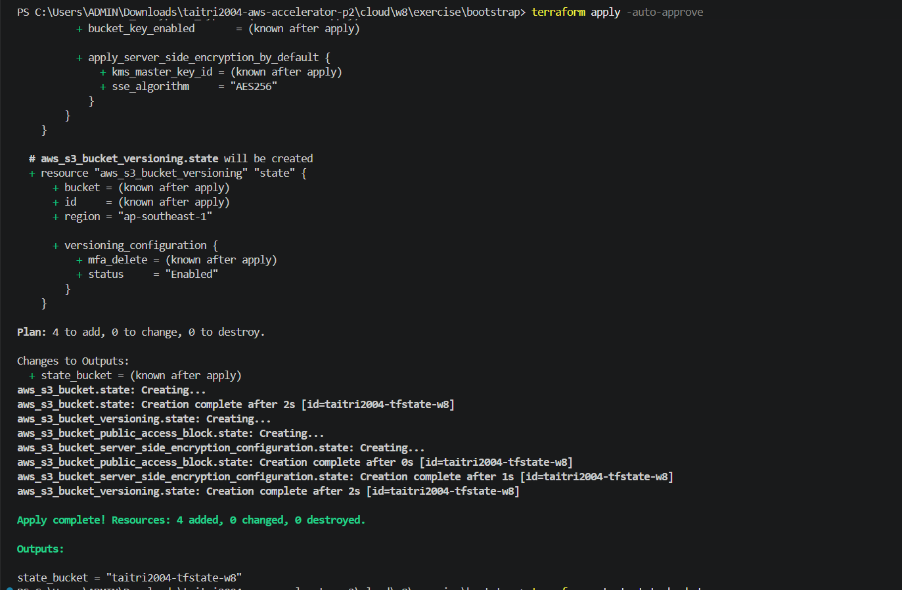
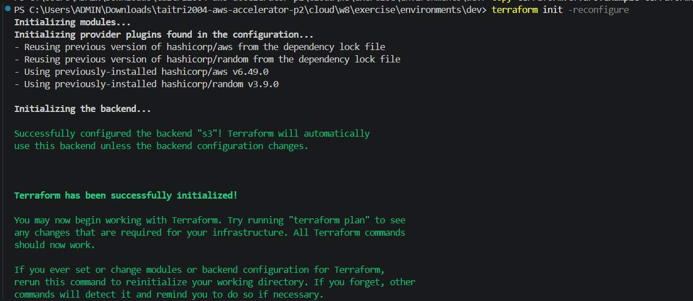
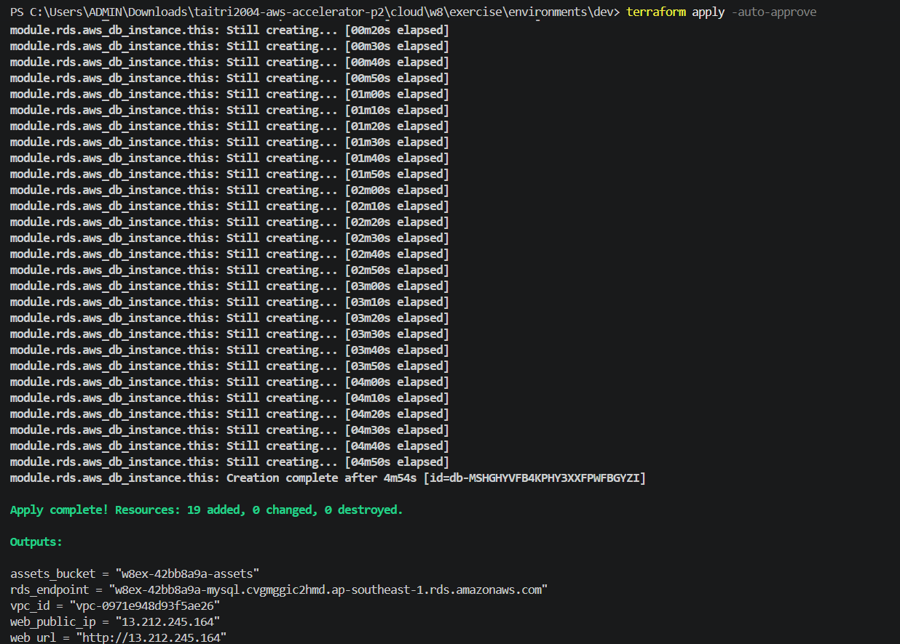
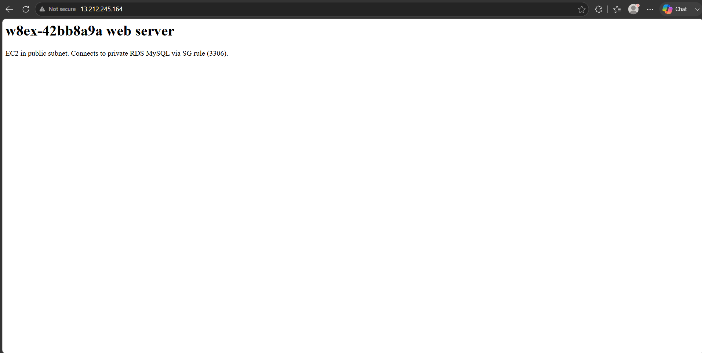
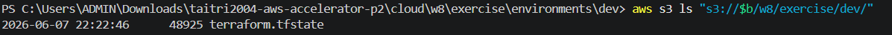
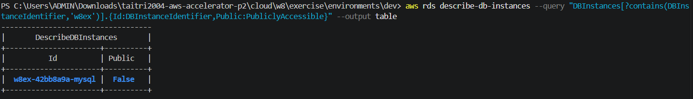
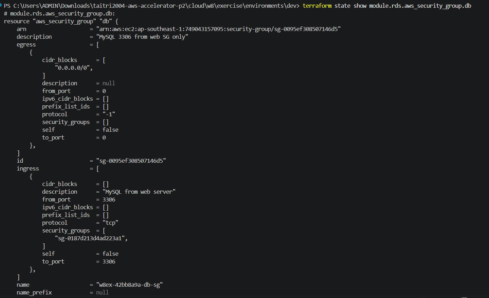
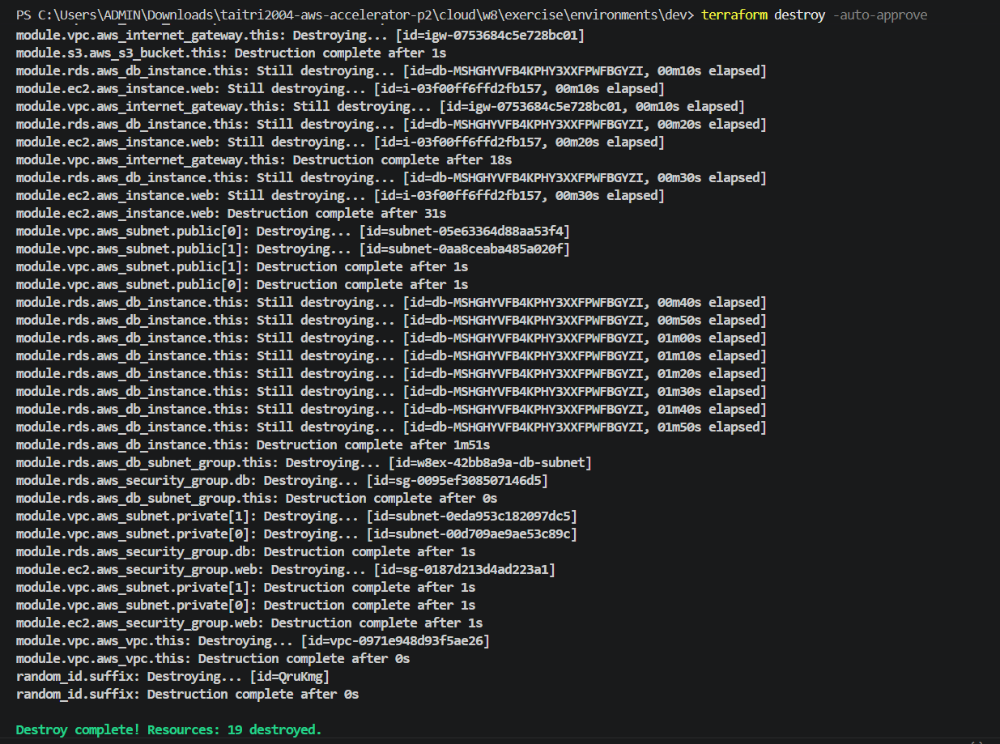
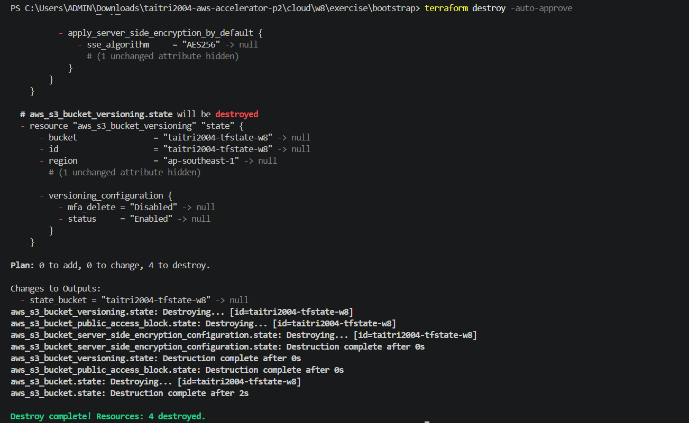

# Evidence Pack - Final Project

## Evidence Map

| Requirement | Evidence |
|---|---|
| Bootstrap creates the S3 remote state bucket | `screenshots/e1-bootstrap.png` |
| Dev environment initializes the S3 backend | `screenshots/e2-dev-init.png` |
| Terraform apply creates the web app stack | `screenshots/e3-dev-apply.png` |
| Web server is reachable from the Internet | `screenshots/e4-web.png` |
| Terraform state is stored in S3 | `screenshots/e5-remote-state.png` |
| RDS is private | `screenshots/e6-security-1.png` |
| RDS security group allows MySQL only from the web security group | `screenshots/e6-security-2.png` |
| Dev stack is destroyed | `screenshots/e7-destroy-1.png` |
| Bootstrap state bucket is destroyed | `screenshots/e7-destroy-2.png` |

## E1 - Bootstrap State Bucket

## E2 - Dev Backend Init

## E3 - Dev Apply

## E4 - Web Server

## E5 - Remote State

## E6 - Security

## E7 - Destroy

