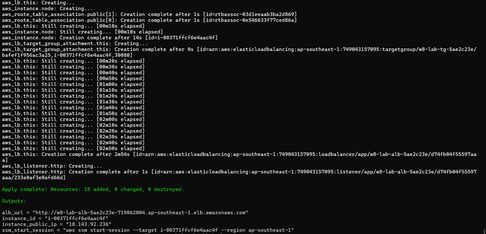
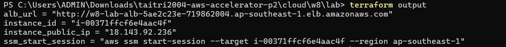
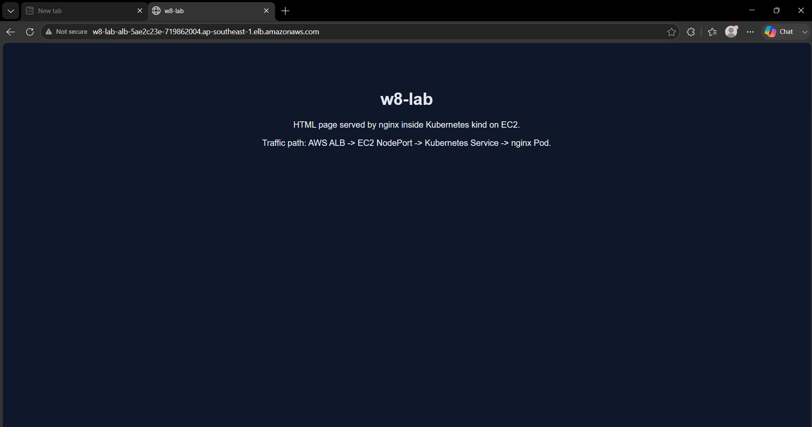
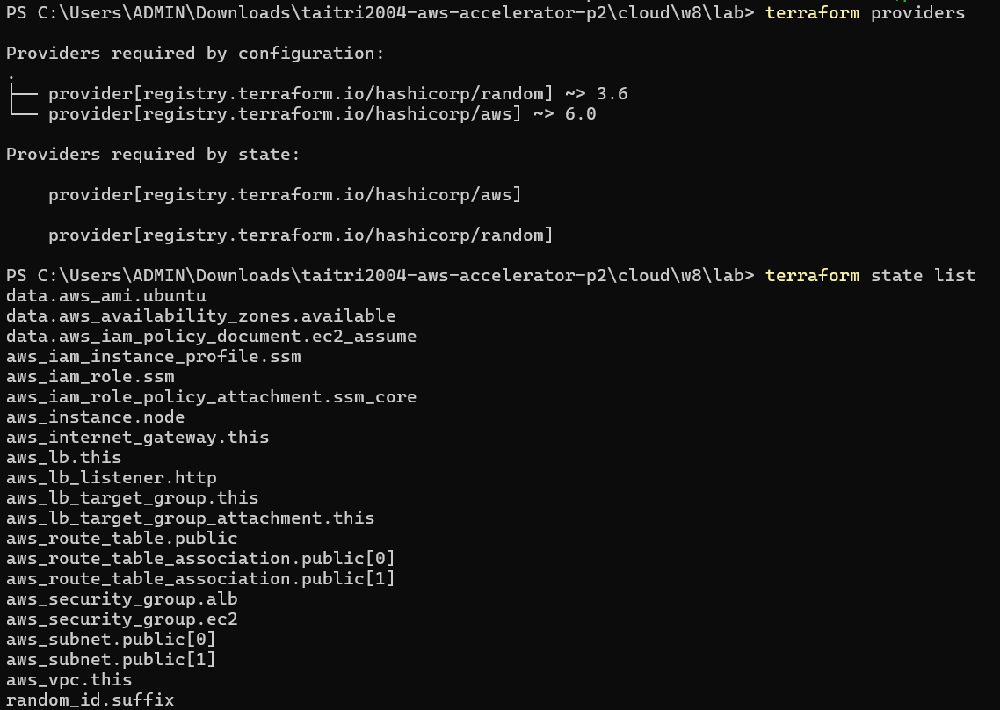
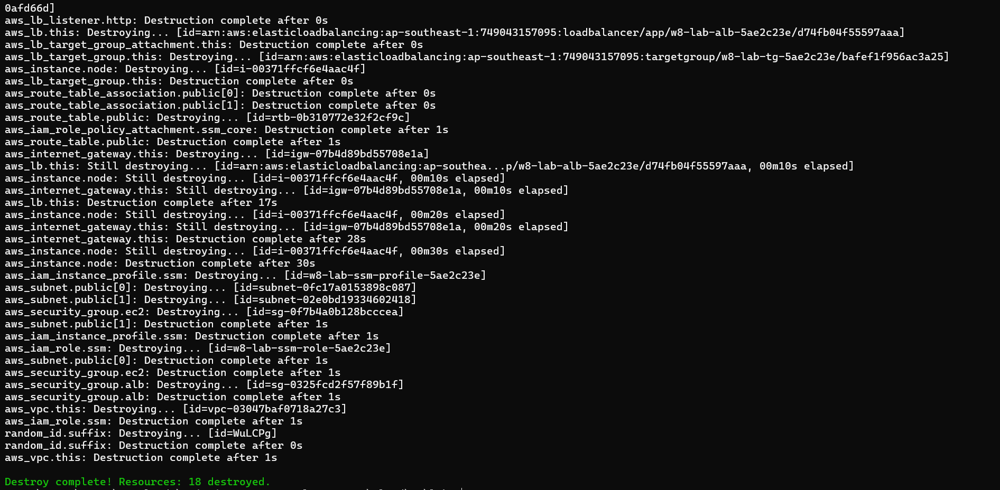

# Evidence Pack - W8 Lab

This file maps the collected screenshots to the lab requirements. Runtime values such as ALB URL, instance ID, and random suffix change on each apply.

## Evidence Map

| Requirement | Evidence |
|---|---|
| One Terraform apply creates the lab | `screenshots/terraform-apply.png` |
| Outputs include ALB URL, instance ID, public IP, and SSM command | `screenshots/terraform-output.png` |
| Browser can open the app through ALB | `screenshots/app-alb.png` |
| Two providers are wired in the same state | `screenshots/terraform-provider.png` |
| Resources are destroyed | `screenshots/terraform-destroy.png` |

## Terraform Apply

```bash
terraform init
terraform apply -auto-approve
```

Expected result:

```text
Apply complete! Resources: 18 added, 0 changed, 0 destroyed.
```



## Terraform Outputs

```bash
terraform output
```

Expected outputs:

```text
alb_url
instance_id
instance_public_ip
ssm_start_session
```



## App Through ALB

Open:

```bash
terraform output -raw alb_url
```

Expected result: browser shows the W8 Lab presentation/demo page through the ALB URL.



## Provider Wiring

```bash
terraform providers
terraform state list
```

Expected result:

- `provider[registry.terraform.io/hashicorp/aws]`
- `provider[registry.terraform.io/hashicorp/random]`
- State includes `random_id.suffix` + AWS resources (EC2, IAM, ALB, target group, security groups)

s

## Terraform Destroy

```bash
terraform destroy -auto-approve
```

Expected result:

```text
Destroy complete! Resources: 18 destroyed.
```


