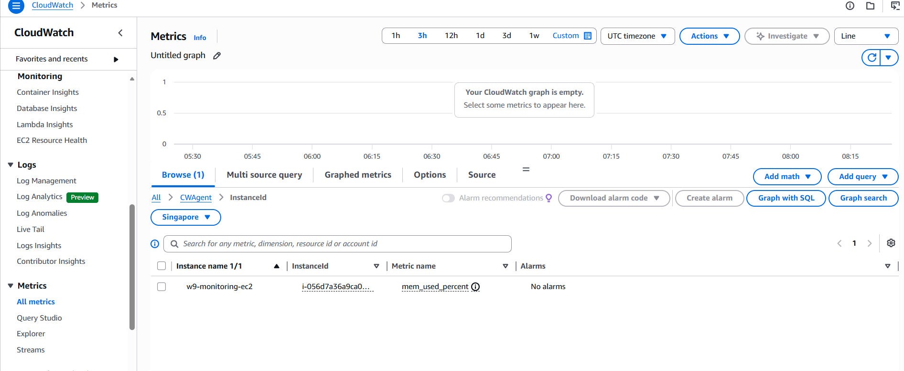
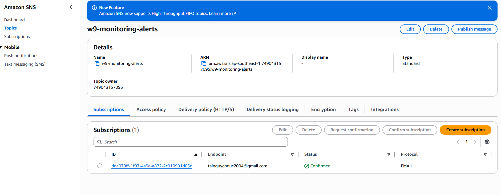
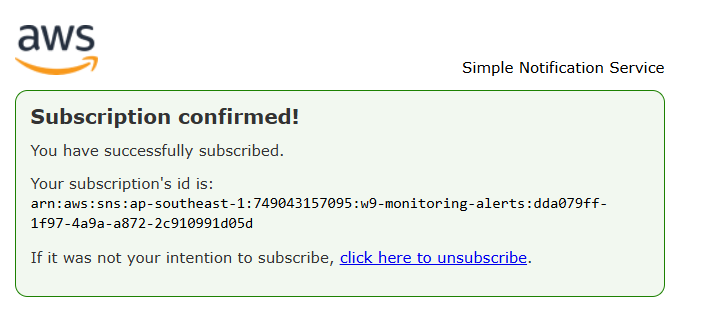
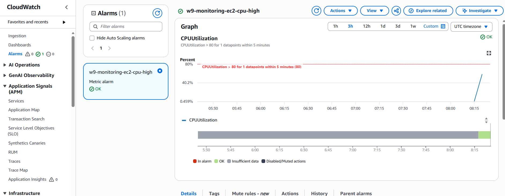
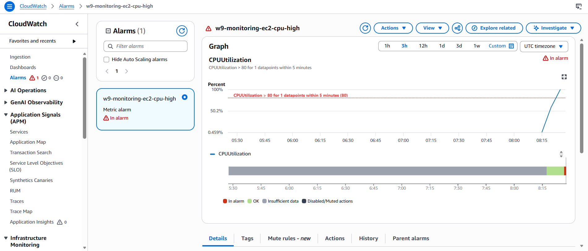
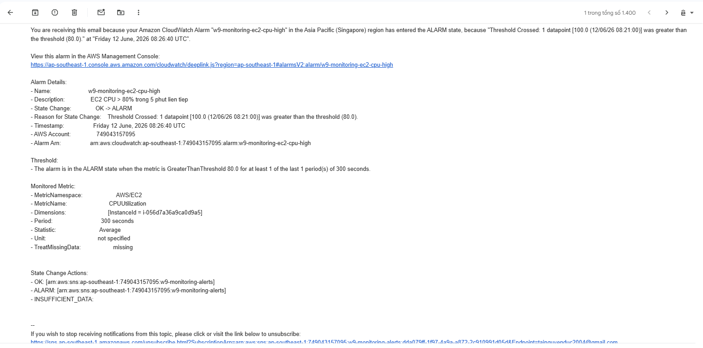

# Evidence Pack — CloudWatch CPU Alarm → Email via SNS

Bằng chứng hoàn thành 2 slide. Region `ap-southeast-1`, account `749043157095`,
dựng bằng Terraform.

## 1. CloudWatch Agent chạy (Session 02)

Agent trên EC2 `w9-monitoring-ec2` (`i-056d7a36a9ca0d9a5`) đẩy custom metric
**`mem_used_percent`** vào namespace `CWAgent` — metric mà host-level mặc định
không có, chứng minh agent đã cài + chạy (IAM role gắn CloudWatchAgentServerPolicy).



## 2. SNS Topic + Subscription confirmed (Session 03 bước 1)

Topic `w9-monitoring-alerts`, subscription email `tainguyenduc2004@gmail.com`
trạng thái **Confirmed** (đã bấm link xác nhận).




## 3. CloudWatch Alarm cấu hình đúng (bước 2-3)

Alarm `w9-monitoring-ec2-cpu-high`: `CPUUtilization > 80 for 1 datapoints within
5 minutes` trên instance đang giám sát.



## 4. Alarm fire → Email (bước 4)

Ép CPU 100% (qua SSM `yes > /dev/null`) > 5 phút → alarm chuyển **In alarm**
→ SNS gửi email "ALARM".

Lý do alarm (khớp email):
```
State Change: OK -> ALARM
Reason: Threshold Crossed: 1 datapoint [100.0 (12/06/26 08:21:00)]
        was greater than the threshold (80.0).
Metric: AWS/EC2 CPUUtilization, Period 300s, Statistic Average
```




Sau khi `pkill yes`, CPU tụt → alarm về **OK** → nhận thêm email recovery
(ok_actions).

## Kết luận

EC2 có CloudWatch Agent đẩy custom metric (memory); CPU alarm mặc định + SNS gửi
email khi vượt ngưỡng và khi phục hồi — đúng scenario "EC2 CPU > 80% for 5
consecutive minutes" của đề.
