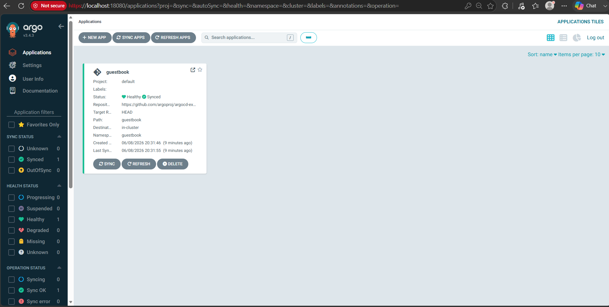
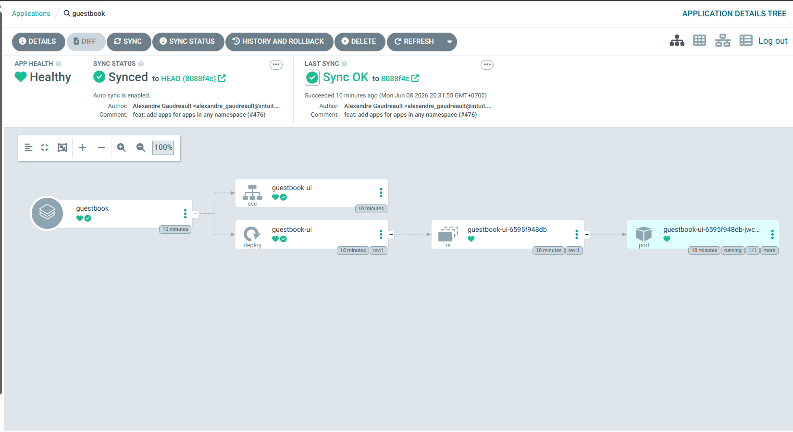
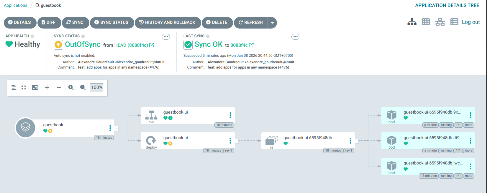
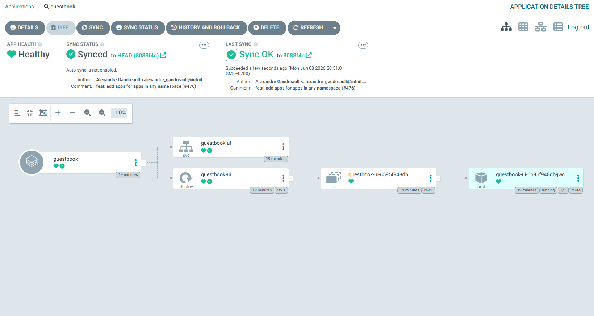
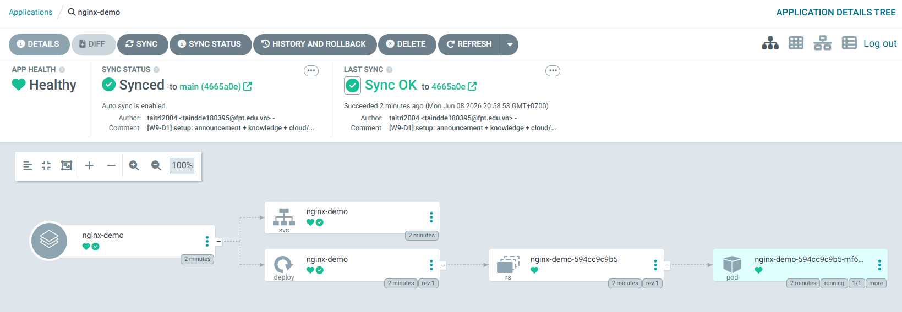
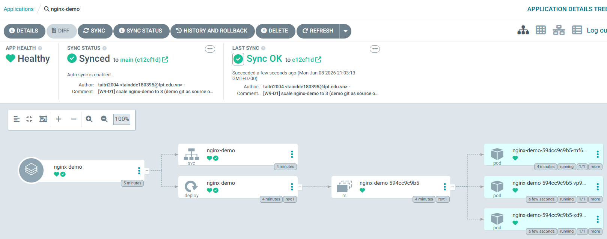
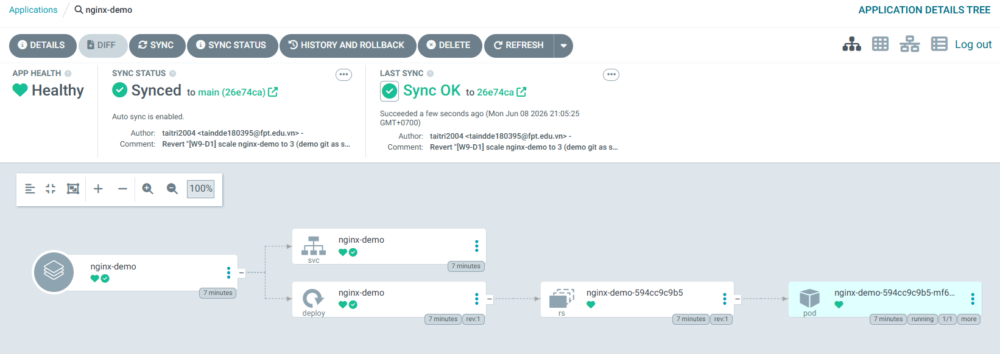
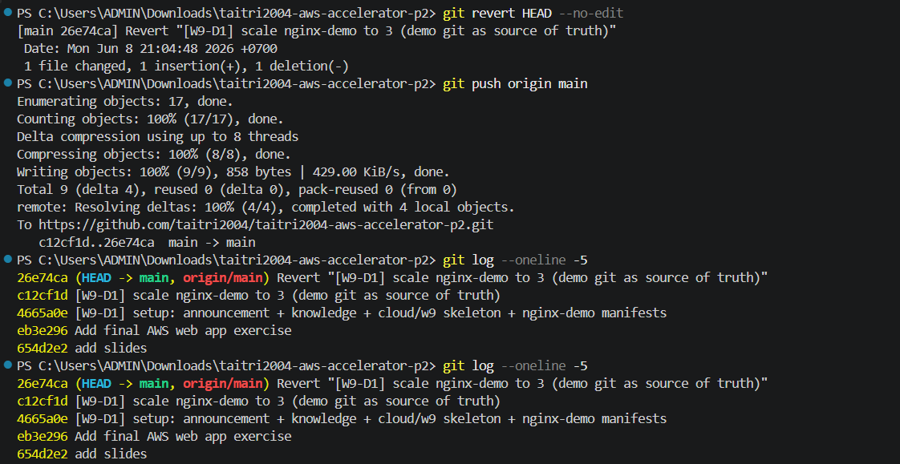
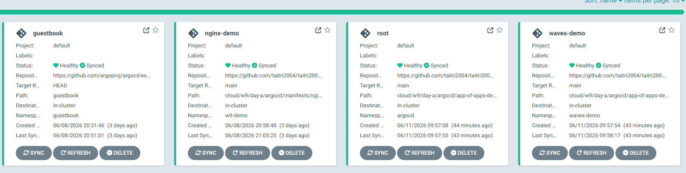

# W9-D1 — Evidence Pack

Bằng chứng đã làm D1 GitOps & CI/CD: cài ArgoCD, deploy Application từ Git,
demo selfHeal, rollback bằng `git revert`, app-of-apps, sync waves và CI
validate manifest.

Môi trường:
- Cluster: minikube v1.38.1 (Docker driver), Kubernetes v1.35.1
- ArgoCD: stable manifest (cài bằng `kubectl apply --server-side --force-conflicts`)
- Port-forward: `localhost:18080 → svc/argocd-server:443`

## 1. ArgoCD UI sau khi sync Application `guestbook`

App Application trỏ tới repo `argoproj/argocd-example-apps`, path `guestbook`.
ArgoCD pull manifest và apply vào namespace `guestbook`.





## 2. SelfHeal — drift cluster, ArgoCD revert

Mô phỏng drift bằng `kubectl -n guestbook scale deploy guestbook-ui --replicas=3`.
Tạm tắt `syncPolicy.automated` để giữ trạng thái `OutOfSync` cho việc chụp ảnh:



Bật lại auto-sync, ArgoCD đồng bộ về một replica theo desired state trong Git:



## 3. Application `nginx-demo` trỏ về chính repo này

Application thứ hai trỏ tới
`cloud/w9/day-a/argocd/manifests/nginx-demo/` trong repo này. Khi commit
push lên `main`, ArgoCD tự pull và apply.



## 4. Demo `git revert` rollback

Thay đổi `replicas: 1 → 3` trong file `deployment.yaml`, commit lên `main`.
ArgoCD sync, deployment scale lên 3 pod:



`git revert HEAD` tạo commit đảo ngược, push. ArgoCD sync lại, deployment
quay về 1 pod:



## 5. Audit trail qua `git log`

`git log` hiện thị đầy đủ chuỗi commit setup → scale up → revert. Audit trail
nằm trong Git, không cần truy vấn cluster.



## 6. App-of-Apps

Root Application `root` trỏ tới folder `cloud/w9/day-a/argocd/app-of-apps-demo/apps`.
Trong folder này có Application con `waves-demo`, nên sau khi apply root một lần,
ArgoCD có thể tự quản các app con theo Git.

Trạng thái kiểm tra:

```text
root         Synced    Healthy
waves-demo   Synced    Healthy
```



Artifact:
- `argocd/root-app-of-apps.yaml`
- `argocd/app-of-apps-demo/root.yaml`
- `argocd/app-of-apps-demo/apps/waves-demo.yaml`

## 7. Sync waves

Application `waves-demo` triển khai app FE/BE đơn giản với thứ tự rõ ràng:

| Resource | Wave |
|---|---:|
| Namespace `waves-demo` | -1 |
| ConfigMap `frontend-content`, `frontend-nginx` | 0 |
| Service `backend` | 1 |
| Deployment `backend` | 2 |
| Deployment `frontend` | 3 |
| Service `frontend` | 4 |

Frontend dùng nginx để serve HTML và proxy `/api` sang backend qua Kubernetes
DNS nội bộ `backend.waves-demo.svc.cluster.local`. Sync waves giúp ConfigMap và
backend service có trước khi frontend khởi động.

Artifact:
- `argocd/app-of-apps-demo/manifests/waves-demo/namespace.yaml`
- `argocd/app-of-apps-demo/manifests/waves-demo/configmap.yaml`
- `argocd/app-of-apps-demo/manifests/waves-demo/deployment.yaml`
- `argocd/app-of-apps-demo/manifests/waves-demo/service.yaml`

## 8. CI validate manifest trên PR

Workflow `validate-w9-day-a` chạy trên pull request khi có thay đổi trong
`cloud/w9/day-a/argocd/app-of-apps-demo/`. Job cài `kubeconform` và validate
Kubernetes manifests trước khi merge.

Artifact:
- `.github/workflows/validate-w9-day-a.yml`
- `cloud/w9/day-a/.github-workflows/validate.yml`

## Kết luận

- ArgoCD pull desired state từ Git, reconcile cluster tự động.
- Mọi thay đổi hợp lệ đi qua Git (commit / PR), không `kubectl apply` tay.
- Rollback chuẩn GitOps = `git revert`, audit trail = `git log`.
- SelfHeal vô hiệu hoá drift do can thiệp tay vào cluster.
- App-of-Apps giúp chỉ cần apply root một lần; app con được quản lý qua Git.
- Sync waves ép đúng thứ tự apply: namespace/config trước, workload sau.
- `waves-demo` có frontend nginx và backend HTTP echo để minh hoạ app nhiều tier.
- CI validate manifest trước khi merge vào `main`.
