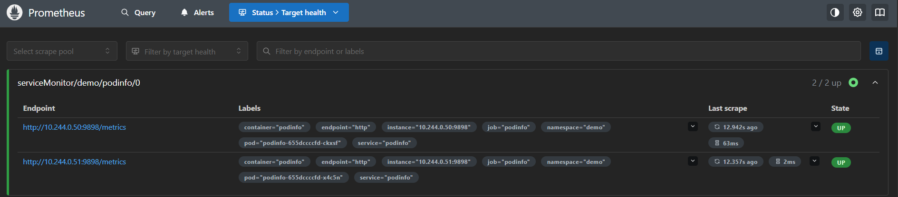
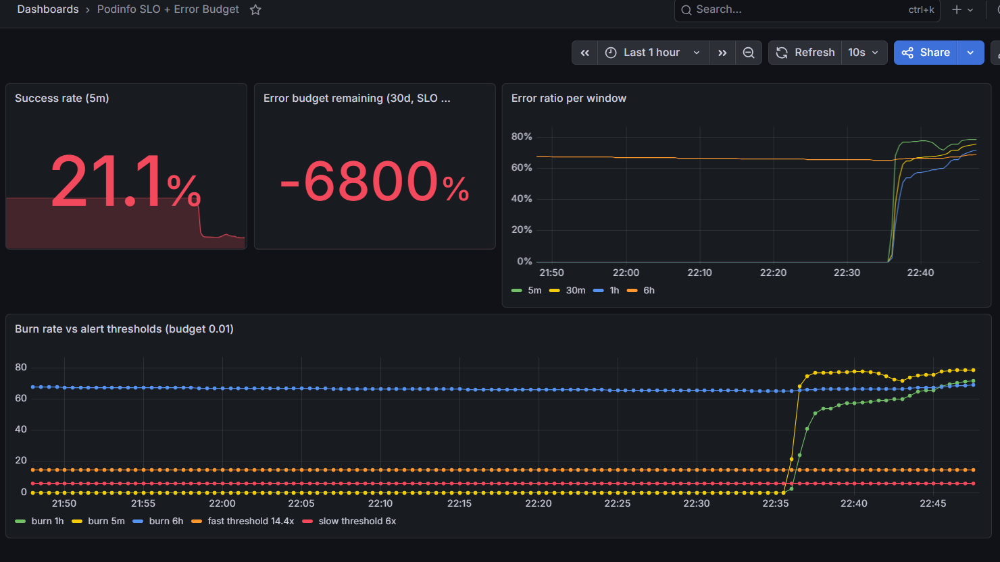
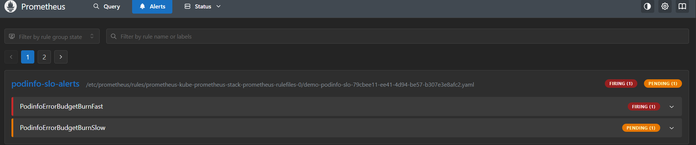

# W9-D2 — Evidence Pack

Bằng chứng đã làm D2 Observability: cài kube-prometheus-stack, scrape app demo
qua ServiceMonitor, định nghĩa SLO + multi-window burn rate alert, sinh lỗi giả
và xác nhận alert chuyển trạng thái inactive → pending → firing.

Môi trường:
- Cluster: minikube (Kubernetes v1.35.1)
- Stack: kube-prometheus-stack (Helm), namespace `monitoring`
- App demo: podinfo 6.7.1, namespace `demo`, expose `http_request_duration_seconds_count{status}`

## 1. Prometheus scrape podinfo (ServiceMonitor hoạt động)

Cả hai pod podinfo được scrape, health = up:

```
podinfo-655dccccfd-ckxsf  health=up  endpoint=http://10.244.0.50:9898/metrics
podinfo-655dccccfd-x4c5n  health=up  endpoint=http://10.244.0.51:9898/metrics
```

## 2. Recording rules đánh giá được

`job:slo_errors:ratio_rate5m` trả về 0 khi không có lỗi (chỉ traffic health
probe 200), xác nhận công thức error ratio đúng.

## 3. Sinh lỗi giả → burn rate vượt ngưỡng → alert firing

Chạy `loadgen.ps1 -ErrorRate 0.8` (gọi `/status/500`). Tiến trình trạng thái
alert `PodinfoErrorBudgetBurnFast` (ngưỡng fast = 14.4 × budget 0.01 = 0.144):

```
[18:39:07] err5m=0      err1h=0      fastAlert=inactive
[18:39:22] err5m=0.269  err1h=0.153  fastAlert=inactive
[18:39:37] err5m=0.269  err1h=0.153  fastAlert=pending
[18:40:37] err5m=0.769  err1h=0.720  fastAlert=pending
[18:41:22] err5m=0.781  err1h=0.742  fastAlert=firing
```

Diễn giải:
- Khi error ratio cả hai cửa sổ (5m và 1h) vượt 0.144, alert vào `pending`.
- Sau `for: 2m` giữ điều kiện, alert chuyển `firing` (lúc 18:41:22).
- Cơ chế multi-window: cả cửa sổ ngắn lẫn dài đều phải vượt ngưỡng mới fire,
  giảm báo nhầm.

## 4. Screenshots

### 4.1 Prometheus scrape podinfo (ServiceMonitor)

`serviceMonitor/demo/podinfo/0` — cả hai endpoint pod ở trạng thái UP.



### 4.2 Grafana dashboard — SLO + burn rate

Khi loadgen bắt đầu (~22:35), success rate (5m) tụt còn 21.1%; các đường burn
rate cửa sổ ngắn (5m, 1h) vọt lên vượt đường ngưỡng fast 14.4x. Cửa sổ dài 6h
vẫn cao do tích luỹ lỗi từ các lần chạy trước trong ngày.



### 4.3 Prometheus alert — multi-window đúng kỳ vọng



- `PodinfoErrorBudgetBurnFast` = **Firing**: điều kiện (1h AND 5m > 14.4×0.01)
  giữ qua `for: 2m` nên đã fire.
- `PodinfoErrorBudgetBurnSlow` = **Pending**: điều kiện (6h AND 30m > 6×0.01)
  đã đúng nhưng `for: 15m` chưa đủ thời gian giữ (load mới chạy ~10 phút) nên
  còn chờ. Đây đúng hành vi mong muốn: alert nhanh page trước, alert chậm cần
  duy trì lâu hơn mới page.

## 5. OTel Collector — pipeline end-to-end

Triển khai OpenTelemetry Collector và telemetrygen để chứng minh luồng telemetry
chạy thông:

```
telemetrygen --OTLP:4317--> collector --prometheus exporter:8889--> Prometheus scrape
              receiver         memory_limiter + batch    exporter
```

Bằng chứng từng chặng:

1. Collector khởi động sạch: log `Everything is ready. Begin running and
   processing data`, OTLP gRPC 4317 + HTTP 4318 + prometheus exporter 8889 đều up.
2. Telemetrygen chạy dạng Deployment và gửi metric liên tục qua OTLP gRPC.
3. Metric `gen` hiện trên cổng prometheus exporter của collector:
   ```
   gen{job="telemetrygen"} <value>
   ```
4. Prometheus scrape collector — target UP và metric queryable:
   ```
   target: serviceMonitor/monitoring/otel-collector/0   health=up
   query gen => gen{job="otel-collector", exported_job="telemetrygen"} <value>
   ```

Ý nghĩa: app chỉ nói OTLP tới collector, không cần biết backend. Đổi backend
(Tempo/Loki/Datadog) chỉ sửa exporter trong config collector, không đụng app.

## Kết luận

- ServiceMonitor (Prometheus Operator) tự động cấu hình scrape, không sửa
  `prometheus.yml` tay.
- SLO định nghĩa bằng recording rule; alert dùng multi-window multi-burn-rate
  theo Google SRE.
- Toàn bộ recording rule + alert khai báo qua `PrometheusRule` CRD, GitOps-friendly.
- OTel Collector tách app khỏi backend observability; pipeline OTLP → prometheus
  exporter → Prometheus đã chạy thông end-to-end.

## Tham chiếu

- Foundation note: [`knowledge/w9-foundation-gitops-observability-canary.md`](../../../knowledge/w9-foundation-gitops-observability-canary.md) §5–§7
- Google SRE — Alerting on SLOs: https://sre.google/workbook/alerting-on-slos
