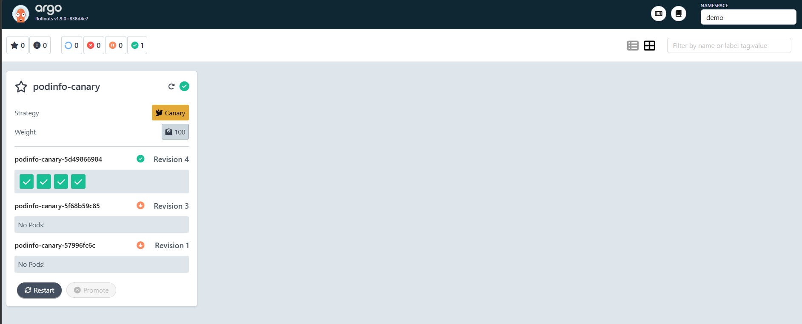
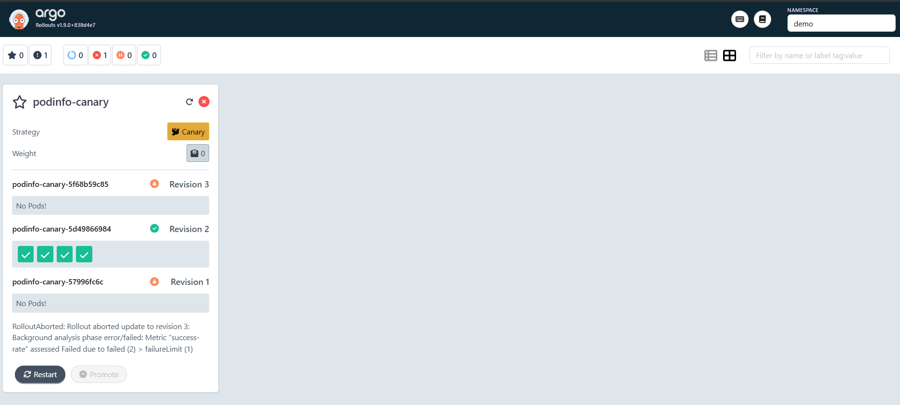

# W9-D3 — Evidence Pack

Bằng chứng đã làm D3 Progressive Delivery (Canary): cài Argo Rollouts, chuyển
podinfo sang `Rollout`, dùng AnalysisTemplate query Prometheus, và chứng minh
hai chiều: canary tốt thì promote, canary tệ thì auto-abort.

Môi trường:
- Cluster: minikube (Kubernetes v1.35.1)
- Argo Rollouts controller v1.9.0 (namespace `argo-rollouts`) + plugin kubectl
- App: podinfo dạng `Rollout` (namespace `demo`, 4 replicas)
- Metric đo: `http_request_duration_seconds_count{service="podinfo-canary"}` (từ D2),
  query qua AnalysisTemplate tới `kube-prometheus-stack-prometheus.monitoring:9090`

## 1. Rollout khởi tạo + Prometheus scrape

Rollout `podinfo-canary` deploy 4 pod, Prometheus scrape cả 4 (health=up qua
ServiceMonitor). AnalysisTemplate `success-rate` đo tỉ lệ request không phải 5xx,
ngưỡng `>= 0.95`, `failureLimit: 1`.

## 2. Demo GOOD — canary pass → promote

Đổi image 6.7.1 → 6.7.0 với traffic sạch (toàn 200). Tiến trình:

```
phase=Progressing step=0/7
phase=Paused      step=1/7  analysis=Running
phase=Paused      step=3/7  analysis=Running
phase=Paused      step=5/7  analysis=Successful
phase=Healthy     step=7/7              -> PROMOTED
```

Kết quả: success rate ~100% ≥ 95% → AnalysisRun **Successful** → canary đi hết
25→50→75→100 → version 6.7.0 thành stable.

## 3. Demo BAD — canary fail → auto-abort

Đổi image 6.7.0 → 6.6.2, đồng thời chuyển load sang `/status/500` (mô phỏng
version regress). Tiến trình:

```
phase=Progressing step=0/7
phase=Paused      step=1/7  analysis=Running
phase=Degraded    step=0/7  analysis=Failed   -> ABORTED
```

Message từ controller:
```
RolloutAborted: Rollout aborted update to revision 3:
Background analysis phase error/failed:
Metric "success-rate" assessed Failed due to failed (2) > failureLimit (1)
```

## 4. Bằng chứng không promote bản lỗi

Sau abort:
- `Status: Degraded`, `Step: 0/7`, stable image = `podinfo:6.7.0` (bản tốt trước đó).
- 4/4 pod đang chạy `6.7.0`. ReplicaSet revision 3 (`6.6.2`) bị **ScaledDown**.
- Lịch sử AnalysisRun:
  ```
  podinfo-canary-...-2   Successful   (GOOD)
  podinfo-canary-...-3   Failed       (BAD)
  ```

Bản lỗi 6.6.2 **không bao giờ ra production** — canary phát hiện metric tệ và tự
revert về stable, không cần can thiệp tay.

## 5. Screenshots

Chụp từ Argo Rollouts dashboard (`kubectl argo rollouts dashboard`).

### 5.1 GOOD — canary promote, Healthy

Rollout Healthy, Weight 100, revision mới (4 pod xanh) là stable.



### 5.2 BAD — canary auto-abort, Degraded

Revision 3 (bản lỗi) ScaledDown, stable giữ ở revision tốt. Message:
`RolloutAborted ... Metric "success-rate" assessed Failed due to failed (2) >
failureLimit (1)`.



## Kết luận

- `Rollout` thay `Deployment` cho phép canary có pause + analysis tự động.
- AnalysisTemplate query Prometheus dùng lại metric SLO của D2 → abort criteria
  nhất quán với observability.
- Background analysis: metric vượt ngưỡng xấu → `failed > failureLimit` →
  AnalysisRun Failed → Rollout auto-abort, revert stable.
- Hoàn tất mục tiêu W9: deploy nào ra cũng canary auto-abort khi metric tệ.

## Tham chiếu

- Foundation note: [`knowledge/w9-foundation-gitops-observability-canary.md`](../../../knowledge/w9-foundation-gitops-observability-canary.md) §8–§10
- Argo Rollouts — Analysis: https://argoproj.github.io/argo-rollouts/features/analysis
