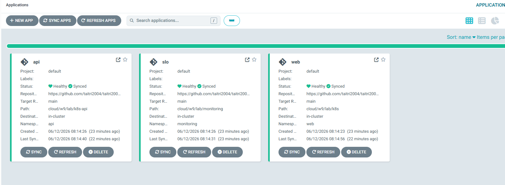
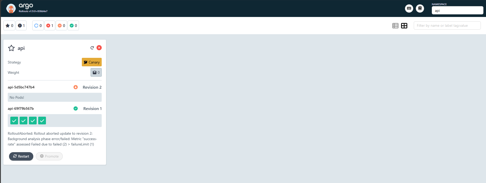
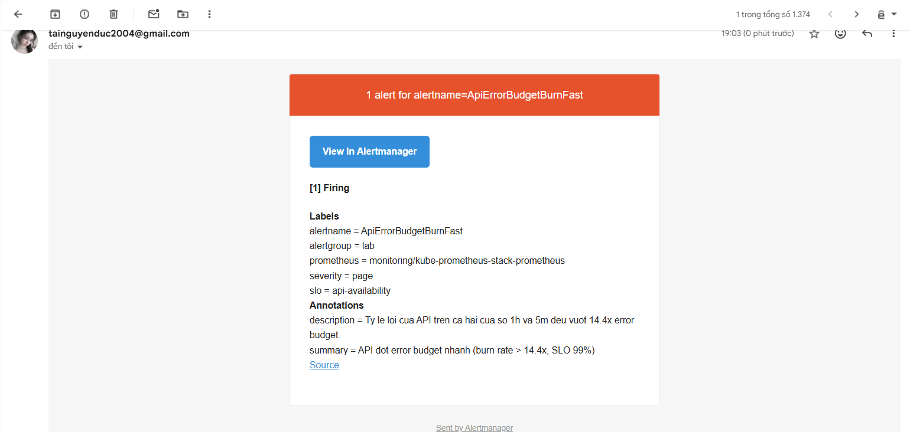

# W9 Lab — Evidence Pack (Ship Smartly)

Bằng chứng cho Challenge. Môi trường: minikube `w9`, ArgoCD, kube-prometheus-stack,
Argo Rollouts, app `w9-api` (Flask) dạng Rollout canary.

## 1. GitOps — mọi thứ qua Git, ArgoCD Synced

Apply `root.yaml` (app-of-apps) một lần → ArgoCD tự tạo app con từ Git. Các app
graded `api`, `slo`, `web` đều Healthy/Synced, repoURL trỏ về repo này, path
`cloud/w9/lab/...` — chứng minh reproduce hoàn toàn từ Git.



## 2. Observability — Prometheus thấy metric api

ServiceMonitor `api` UP, query `flask_http_request_total{namespace="api"}` tăng;
baseline success-rate = 1.0 (loadgen sinh traffic sạch).

## 3. Canary auto-abort (quan trọng nhất) — đã verify

Môi trường verify: ns `api`, Rollout `api` (image `w9-api:1`), loadgen sinh traffic,
Prometheus scrape 4/4 pod UP, baseline success-rate = 1.0.

BAD run — deploy v2 với `ERROR_RATE=0.5`:

```
[18:39:32] phase=Paused     step=1  analysis=Running
[18:40:09] phase=Progressing step=2 analysis=Running
[18:40:22] phase=Paused     step=3  analysis=Running
[18:40:34] phase=Degraded   step=0  analysis=Failed   -> AUTO-ABORT
```

Message controller:
```
RolloutAborted: Rollout aborted update to revision 2:
Background analysis phase error/failed:
Metric "success-rate" assessed Failed due to failed (2) > failureLimit (1)
```

Trạng thái sau abort:
- ReplicaSet revision 2 (bad, ERROR_RATE=0.5) -> ScaledDown (0 replica).
- ReplicaSet revision 1 (good) -> 4/4 ready.
- 4 pod đang chạy đều `ERROR_RATE=0 VERSION=v1`. Bản lỗi v2 KHÔNG ra production.



## 4. SLO + alert → email — đã verify

- SLO 99% (error budget 1%); recording rule error ratio 5m/30m/1h/6h.
- Alert multi-window burn-rate `ApiErrorBudgetBurnFast` (1h AND 5m > 14.4x budget,
  for 2m) + alert nhanh `ApiHighErrorRate` (5m > 5%, for 1m) — đều label
  `alertgroup=lab`.
- AlertmanagerConfig `lab-email` route alert `alertgroup=lab` → Gmail SMTP
  (smtp.gmail.com:587, app password trong secret `smtp-secret`, KHÔNG commit).

Diễn tiến verify: deploy injector lỗi 100% (Service chia ~50% traffic lỗi) →
error ratio 5m leo 0.05 → 0.44; sau ~10 phút cửa sổ 1h cũng vượt 14.4x budget →
`ApiErrorBudgetBurnFast` Firing → Alertmanager gửi email.

Email nhận được:
```
1 alert for alertname=ApiErrorBudgetBurnFast — [1] Firing
Labels: alertname=ApiErrorBudgetBurnFast, alertgroup=lab, severity=page,
        slo=api-availability
Annotations: summary "API dot error budget nhanh (burn rate > 14.4x, SLO 99%)"
Sent by Alertmanager
```



## 5. Rollback < 5 phút

- `git revert` → ArgoCD sync về bản cũ; audit qua `git log`.

## Kết luận

GitOps + Observability + Canary ghép thành 1 pipeline: đổi version qua Git →
canary thả dần → SLO/metric tự chấm → tốt thì 100%, tệ thì auto-abort + alert email.
